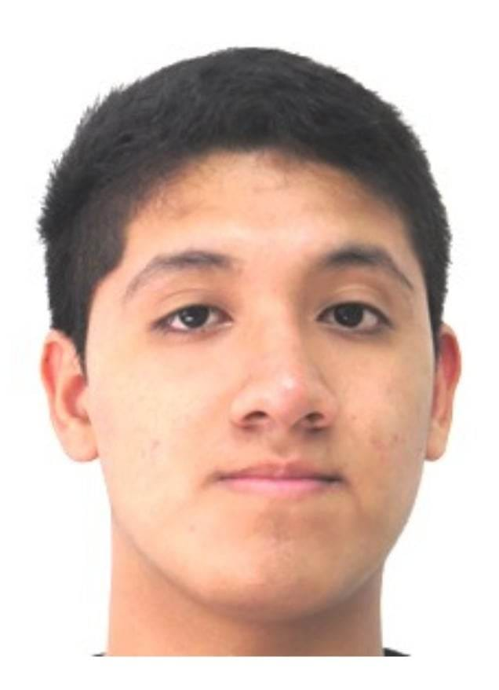

# Capítulo I: Introducción

## 1.1. Startup Profile
### 1.1.1. Descrición de Startup
AgroCare es una startup peruana de tecnología agropecuaria fundada por un equipo de estudiantes de Ingeniería de Software de la Universidad Peruana de Ciencias Aplicadas(UPC). Nace como respuesta a una problemática real y urgente en el sector ganadero peruano: la ausencia de herramientas digitales accesibles que permitan a los productores, tanto independientes como empresariales, gestionar su ganado de manera eficiente, trazable y sostenible.

| Misión                                                                                                                                                                                                                                                                                                                                                                                       | Visión                                                                                                                                                      |
|----------------------------------------------------------------------------------------------------------------------------------------------------------------------------------------------------------------------------------------------------------------------------------------------------------------------------------------------------------------------------------------------|-------------------------------------------------------------------------------------------------------------------------------------------------------------|
| Empoderar a los ganaderos peruanos con una plataforma tecnológica accesible que simplifique la gestión de su ganado, mejore su productividad y promueva una ganadería sostenible y responsable. | Ser la plataforma de gestión ganadera líder en Latinoamérica, impulsando la transformación digital del sector agropecuario con tecnología innovadora al servicio del bienestar animal y el desarrollo rural. |

### 1.1.2. Perfiles de integrantes del equipo
|                                                                                     |Integrantes del equipo|Código de estudiante| Carrera | Conocimientos/Habilidades                                                                                                                                                                                                                                                      |
|-------------------------------------------------------------------------------------| --- | --- | --- |--------------------------------------------------------------------------------------------------------------------------------------------------------------------------------------------------------------------------------------------------------------------------------|
|    | Flores Manrique, Sebastian Enrique | U201611430 | Ingeniería de Software | Soy estudiante de la carrera de Ingeniería de software. Actualmente cursando el sexto ciclo de la carrera. Me considero una persona responsable y dispuesto a ayudar en lo que haga falta. Tengo conocimientos en lenguaje de programación de C++, Python, FrontEnd y BackEnd. |
|  | De las Casas Latour, Sebastián | U202213553 | Ingeniería de Software | Tengo 22 años y actualmente estoy cursando la carrera de Ingeniería de Software en la UPC. Me considero una persona paciente, optimista y que se maneja bien bajo presión. Como miembro del equipo me esforzaré en apoyar en todo lo que pueda al avance del trabajo. |
|  
   | Esquirva León, Miguel Juan Diego | U202310837 | Ingeniería de Software |  Soy estudiante de Ing de Software en la UPC. Soy una persona resiliente perseverante que se esfuerza bastante en afrontar nuevos retos siempre con la mirada en alto                                                                                                                                                                                                                                                                             |
|                                                                                       | Inga Hernández, Ayrton Damian | U201924756 | Ingeniería de Software |   Soy estudiante de Ingenieria de software en la UPC. Me considero una persona que se esfuerza para seguir adelante en mis estudios mientras intento equilibrar mi vida laboral, cuento con conocimientos de frontend y backend.                                                                                                                            |
|                                                                                     | Meza Tataje, David | U202516291 | Ingeniería de Software | Soy David Meza estudiante de Ingeniería de Software, tengo 20 años, con conocimientos en C++, Java y C# a nivel intermedio, además de experiencia básica en el desarrollo de aplicaciones web con HTML, CSS, JavaScript y SQL. Me considero una persona colaboradora y responsable, siempre dispuesto a aprender y a trabajar en equipo para lograr los objetivos del proyecto.                                                                                                                                                                                                                                                                               |

## 1.2. Solution Profile
### 1.2.1. Antecedentes y problemática
El sector ganadero peruano representa una actividad económica fundamental para miles de familias rurales, sin embargo, enfrenta serias limitaciones en cuanto a la adopción de tecnología para la gestión de sus operaciones. La mayoría de productores, tanto independientes como empresariales, continúan operando con métodos manuales como cuadernos y hojas de cálculo, lo que genera desorganización, errores en la toma de decisiones, pérdidas económicas y un deficiente control del bienestar animal.
Aplicando la técnica de las 5W's y 2H's, se identificaron los siguientes aspectos clave del problema:
> What(¿Qué?): Los ganaderos peruanos carecen de herramientas digitales que les permitan realizar un seguimiento detallado y centralizado de la salud, alimentación, reproducción e historial clínico de su ganado. Esta ausencia impide tomar decisiones informadas y oportunas, afectando directamente la productividad y el bienestar animal.

> Who (¿Quién?): Los principales afectados son los productores ganaderos independientes con rebaños pequeños o medianos, quienes cuentan con recursos limitados para acceder a servicios veterinarios y tecnológicos, y las empresas ganaderas de gran escala, que enfrentan retos en la coordinación de personal, trazabilidad del ganado y cumplimiento de estándares de bienestar animal.

> Where (¿Dónde?): La problemática se concentra en las zonas rurales y áreas productivas del Perú, donde el acceso a servicios veterinarios, tecnológicos y de conectividad es limitado. Sin embargo, el incremento progresivo de la cobertura móvil en estas regiones abre una ventana de oportunidad para soluciones digitales basadas en dispositivos móviles.

> When (¿Cuándo?): Se trata de una problemática permanente y en crecimiento. La necesidad de digitalización es constante, ya que los ganaderos requieren acceso a información en tiempo real sobre la salud, alimentación, reproducción y comercialización de su ganado durante todo el año.

> Why (¿Por qué?): La falta de herramientas adecuadas provoca una gestión ineficiente que se traduce en enfermedades no atendidas a tiempo, alimentación deficiente, baja productividad reproductiva y pérdidas económicas del productor. Tomar decisiones con información incompleta compromete tanto el bienestar animal como la rentabilidad del negocio.

> How (¿Cómo?): A través de una aplicación móvil y web que centralice la gestión ganadera, permitiendo registrar y monitorear en tiempo real la salud, alimentación y reproducción de cada animal, generar alertas automáticas, acceder a contactos veterinarios y producir reportes que faciliten la toma de decisiones. La solución está diseñada para funcionar incluso en condiciones de baja conectividad.

> How Much (¿Cuánto?): Para los productores, el impacto económico esperado es positivo: reducción de pérdidas por enfermedades y gestión ineficiente, optimización de recursos alimentarios y mayor productividad del hato. Para la empresa, el modelo de negocio se sostendrá mediante suscripciones de bajo costo accesibles para ambos segmentos del mercado.
### 1.2.2. Lean UX Process
### 1.2.2.1. Lean UX Problem Statements
**Domain:** Gestión tecnológica del sector ganadero peruano.

**Customer Segments:** Productores ganaderos peruanos (independientes y empresariales) que buscan digitalizar y optimizar la gestión de su ganado, y veterinarios especializados que requieren herramientas para brindar seguimiento clínico remoto y oportuno a sus pacientes.

**Pain points:** 
* Los ganaderos independientes llevan registros manuales dispersos en cuadernos o Excel, lo que genera pérdida de información, desorganización y demoras en la atención animal.
* Las empresas ganaderas enfrentan dificultades para coordinar personal, gestionar grandes volúmenes de datos y mantener trazabilidad del ganado de manera eficiente.
* Ambos segmentos tienen acceso limitado o tardío a servicios veterinarios, lo que incrementa las pérdidas por enfermedades prevenibles.
* La baja conectividad en zonas rurales limita el uso de soluciones digitales convencionales.

**Gap:** Existe una brecha significativa entre las necesidades de gestión del sector ganadero peruano y la oferta de soluciones tecnológicas accesibles, adaptadas al contexto rural local y orientadas a la sostenibilidad y el bienestar animal.

**Visión / Strategy:** Desarrollar una plataforma móvil y web intuitiva, funcional en condiciones de baja conectividad, que centralice la gestión ganadera y empodere a los productores con información en tiempo real para tomar decisiones fundamentadas.

**Initial Segment:** Productores ganaderos del Perú, mayores de 18 años, ubicados en zonas rurales o periurbanas, que manejan diversas especies y buscan mejorar la organización y control de sus operaciones con herramientas digitales accesibles desde el celular.

### 1.2.2.2. Lean UX Assumptions
### User Assumptions:

1. Los ganaderos, independientemente de su nivel tecnológico, adoptarán una aplicación si es fácil de usar, intuitiva y les resuelve problemas concretos de su día a día.
2. Los usuarios están dispuestos a incorporar tecnología si perciben beneficios tangibles en ahorro de tiempo, reducción de pérdidas y mejora en la salud de sus animales.
3. Los ganaderos en zonas rurales usarán la aplicación incluso sin conexión constante, siempre que funcione correctamente en modo offline.
4. Los usuarios confiarán en la plataforma si garantiza la privacidad de su información productiva y veterinaria.
5. Las funciones más utilizadas deben estar accesibles en pocos pasos, ya que los ganaderos priorizan soluciones prácticas y rápidas.
6. Los veterinarios especializados adoptarán la plataforma si les permite hacer seguimiento clínico de sus pacientes de forma remota, registrar tratamientos y coordinar citas de manera organizada.

### Business Assumptions:

1. Si digitalizamos los registros del ganado, los usuarios mejorarán significativamente la organización y trazabilidad de su inventario animal.
2. Si ofrecemos recordatorios automáticos y alertas sanitarias, los ganaderos reducirán pérdidas económicas por enfermedades prevenibles.
3. Si proporcionamos herramientas de planificación alimentaria, los productores optimizarán el uso de recursos y reducirán desperdicios.
4. Si permitimos el seguimiento reproductivo eficiente, los ganaderos incrementarán la productividad de sus hatos.
5. Si garantizamos una experiencia fluida en dispositivos móviles, incluido el modo sin conexión, mejoraremos la adopción en zonas rurales con conectividad limitada.
6. Si aseguramos la privacidad y seguridad de los datos, los usuarios confiarán en la plataforma y estarán dispuestos a almacenar información crítica en ella.
7. Si integramos un módulo para veterinarios que les permita gestionar historiales clínicos y coordinar atención, incrementaremos la confianza de los ganaderos en la plataforma y fidelizaremos a ambos segmentos simultáneamente

### 1.2.2.3. Lean UX Hypothesis Statements

1. Creemos que los ganaderos valorarán una interfaz intuitiva y fácil de aprender porque podrán gestionar su ganado sin capacitación extensa. Sabremos que tuvimos éxito cuando al menos el 70% de los nuevos usuarios complete el registro de animales en su primer uso sin asistencia.
2. Creemos que los usuarios adoptarán la aplicación si les permite ahorrar tiempo en tareas administrativas porque desean enfocarse en actividades productivas. Sabremos que tuvimos éxito cuando se reduzca en un 40% el tiempo promedio reportado en registros manuales.
3. Creemos que los ganaderos en zonas rurales usarán la app regularmente si funciona en modo offline porque tienen conectividad limitada en sus áreas de trabajo. Sabremos que tuvimos éxito cuando el 60% de los usuarios active el modo sin conexión al menos una vez por semana.
4. Creemos que los usuarios confiarán en la plataforma si garantizamos la privacidad de sus datos porque manejan información sensible sobre su producción. Sabremos que tuvimos éxito cuando menos del 5% de los usuarios exprese preocupaciones sobre seguridad en encuestas de retroalimentación.
5. Creemos que si destacamos las funciones de salud animal, alimentación y reproducción como accesos principales, los usuarios las emplearán frecuentemente porque representan sus necesidades más críticas. Sabremos que tuvimos éxito cuando estas funciones representen al menos el 70% del uso total dentro de la app.
6. Creemos que los usuarios percibirán beneficios concretos en productividad y bienestar animal porque contarán con información organizada para tomar mejores decisiones. Sabremos que tuvimos éxito cuando el 60% de los usuarios reporte mejoras en el rendimiento de su ganado tras tres meses de uso.

### 1.2.2.4. Lean UX Canvas

## 1.3. Segmentos objetivo

Bovix ha sido diseñada considerando la diversidad del ecosistema ganadero peruano. A partir del análisis del dominio del problema se identificaron dos segmentos objetivos con necesidades, motivaciones y características diferenciadas.

### Segmento 1: Productores Ganaderos (Independientes y Empresariales)
Este segmento agrupa a todos los actores del sector ganadero peruano que se dedican a la crianza, manejo y comercialización de animales, desde pequeños productores independientes con rebaños reducidos hasta empresas ganaderas de mediana y gran escala.

**Características demográficas:**
* País: Perú, con foco principal en zonas rurales y periurbanas de la sierra, selva y costa.
* Género: Femenino y masculino.
* Edad: Mayores de 18 años, en etapa productiva activa.
* Ocupación: Ganaderos independientes, administradores o gestores de empresas ganaderas.
* Estado civil: Todos los estados.
* Nivel socioeconómico: Todos los niveles, con mayor concentración en NSE C y D en el caso de productores independientes, y NSE B y C en empresas ganaderas.

**Datos estadísticos de sustento:**
* Se estima que al menos el 15% de las muertes animales en granjas peruanas se relaciona con la falta de acceso oportuno a atención veterinaria, lo que genera pérdidas equivalentes a aproximadamente el 20% de los ingresos anuales del productor.
* Alrededor del 60% de las operaciones ganaderas empresariales en el Perú no cumple con estándares aceptables de bienestar animal.
* Cerca del 70% de las empresas ganaderas presenta una gestión inadecuada de residuos, con riesgos potenciales de contaminación ambiental.
* El incremento progresivo de la cobertura móvil en zonas rurales peruanas representa una oportunidad concreta para la adopción de soluciones digitales en este segmento.

### Segmento 2: Veterinarios Especializados
Este segmento comprende a profesionales de la medicina veterinaria con especialización o experiencia en ganado bovino, ovino, caprino u otras especies de producción, que brindan servicios de atención clínica, preventiva y reproductiva a productores del sector.

**Características demográficas:**
* País: Perú, con presencia tanto en zonas urbanas (clínicas y consultorios) como en zonas rurales (atención en campo).
* Género: Femenino y masculino.
* Edad: Entre 23 y 55 años, en etapa profesional activa.
* Ocupación: Médicos veterinarios independientes o adscritos a empresas ganaderas, clínicas veterinarias o instituciones del agro.
* Nivel de educación: Educación superior completa, con título profesional en Medicina Veterinaria o Zootecnia.
* Nivel socioeconómico: NSE B y C.

**Datos estadísticos de sustento:**
* Según el Colegio Médico Veterinario del Perú, el país cuenta con miles de veterinarios colegiados, de los cuales una parte significativa se orienta a la medicina de grandes animales y producción pecuaria.
* La escasa presencia de veterinarios en zonas rurales es uno de los principales factores que explica el 15% de mortalidad animal evitable identificado en el sector, evidenciando la necesidad de plataformas que conecten a estos profesionales con los productores de manera ágil y organizada.
* La digitalización de historiales clínicos veterinarios es aún incipiente en el Perú, lo que representa una oportunidad directa para que VacApp se posicione como la herramienta de referencia para este segmento.
