# Capítulo II: Requirements Development and Software Solution Design
## 2.1. Competidores
### 2.1.1. Análisis Competitivo 

<table border="1" cellpadding="6" cellspacing="0" style="border-collapse:collapse; width:100%; font-family:Arial, sans-serif;">
  <thead>
    <tr>
      <th colspan="6" scope="col" style="background:#f2f2f2;"><strong>Competitive Analysis Landscape</strong></th>
    </tr>
    <tr>
      <th colspan="2" rowspan="2" scope="row">¿Por qué realizar este análisis?</th>
      <td colspan="4" style="">
        <strong>Escriba en el recuadro la pregunta que busca responder o el objetivo de este análisis.</strong>
      </td>
    </tr>
    <tr>
      <td colspan="4" style="">
        El objetivo del análisis es obtener una perspectiva clara sobre qué brechas estratégicas existen en el mercado que otras soluciones no estén abarcando, obteniendo así un factor diferenciador de nicho que permita posicionar nuestro producto como idóneo para MYPES centradas en el sector agrario.
      </td>
    </tr>
    <tr>
      <th colspan="2" scope="row">(En la cabecera colocar por cada competidor nombre y logo)</th>
      <th scope="column" style="width:20%; text-align:center;">
        Bovix 
        
      </th>
      <th scope="column" style="width:20%; text-align:center;">
        CattleMax 
        
      </th>
      <th scope="column" style="width:20%; text-align:center;">
        Herdwatch 
        
      </th>
      <th scope="column" style="width:20%; text-align:center;">
        AgriWebb 
        
      </th>
    </tr>
  </thead>
  <tbody>
    <tr>
      <th scope="row" rowspan="2">Perfil</th>
      <th scope="row">Overview</th>
      <td>Startup peruana de tecnología agropecuaria enfocada en digitalizar la gestión ganadera mediante una plataforma móvil y web.</td>
      <td>Software especializado en gestión ganadera con más de 20 años en el mercado, enfocado en registro detallado de datos productivos y reproductivos.</td>
      <td>Aplicación móvil enfocada en facilidad de uso y operación en campo, con fuerte enfoque “mobile-first”.</td>
      <td>Plataforma empresarial para gestión ganadera a gran escala, con enfoque en trazabilidad, cumplimiento y operaciones multi-finca.</td>
    </tr>
    <tr>
      <th scope="row">Ventaja competitiva</th>
      <td>Accesible, simple y adaptada a la realidad rural peruana, combinando bajo costo, funcionamiento en baja conectividad y enfoque local.</td>
      <td>Profundidad y precisión en la gestión de datos ganaderos, especialmente en aspectos reproductivos y genéticos.</td>
      <td>Facilidad de uso en dispositivos móviles, diseñada para registrar información directamente en campo.</td>
      <td>Escalabilidad empresarial y trazabilidad integral, ideal para operaciones ganaderas grandes o multi-finca.</td>
    </tr>
    <tr>
      <th scope="row" rowspan="2">Perfil de Marketing</th>
      <th scope="row">Mercado Objetivo</th>
      <td>Ganaderos pequeños y medianos en Perú y Latinoamérica; Empresas ganaderas en crecimiento (no enterprise)</td>
      <td>Ganaderos medianos y grandes; Operaciones especializadas (genética, reproducción, pedigree)</td>
      <td>Pequeños y medianos ganaderos; Usuarios que priorizan simplicidad y uso en campo</td>
      <td>Empresas ganaderas grandes; Operaciones multi-propiedad; Mercados internacionales</td>
    </tr>
    <tr>
      <th scope="row">Estrategias de Marketing</th>
      <td>Marketing digital móvil-first (Facebook, WhatsApp, TikTok rural); Estrategia freemium para captar usuarios</td>
      <td>Enfoque en precisión técnica y datos avanzados; Marketing dirigido a productores profesionales; Reputación basada en experiencia y confiabilidad (legacy software)</td>
      <td>Diferenciación por facilidad de uso; Enfoque en productividad diaria; Freemium (entrada gratuita para captar usuarios)</td>
      <td>Posicionamiento como solución enterprise; Inversión en expansión global y financiamiento; Enfoque en cumplimiento normativo y escalabilidad </td>
    </tr>
    <tr>
      <th scope="row" rowspan="3">Perfil de Productos</th>
      <th scope="row">Productos y servicios</th>
      <td>Registro de ganado (identificación individual); Historial de salud y tratamientos
Control reproductivo; Gestión de alimentación</td>
      <td>Registro completo del ganado (salud, reproducción, genética); Reportes avanzados y análisis de datos; Gestión de inventario y productividad</td>
      <td>Perfiles individuales de animales; Seguimiento de salud y reproducción; Alertas y recordatorios; Registros financieros básicos</td>
      <td>Gestión integral del ganado; Trazabilidad completa; Reportes avanzados; Integraciones con otros sistemas</td>
    </tr>
    <tr>
      <th scope="row">Precios y costos</th>
      <td>Freemium (versión básica gratuita); Suscripción mensual o anual de bajo costo(menos de 100$)</td>
      <td>Suscripción: $199 – $399/año; Prueba gratuita</td>
      <td>Plan gratuito (limitado); Planes pagados: $119 – $299/año</td>
      <td>Desde $500 hasta $5,000+/año</td>
    </tr>
    <tr>
      <th scope="row">Canales de distribución</th>
      <td>App móvil (Android principalmente); Plataforma web</td>
      <td>Plataforma web (cloud); Venta directa online (SaaS)</td>
      <td>App móvil (Android/iOS); Plataforma web sincronizada (cloud)</td>
      <td>Plataforma web + app móvil; Ventas B2B directas; Implementaciones empresariales</td>
    </tr>
    <tr>
      <th scope="row" rowspan="5">Análisis SWOT</th>
      <th scope="col" colspan="5" style=" text-align:left;">
        Realice esto para su startup y sus competidores. Sus fortalezas deberían apoyar sus oportunidades y contribuir a lo que ustedes definen como su posible ventaja competitiva.
      </th>
    </tr>
    <tr>
      <th scope="row">Fortalezas</th>
      <td>Mobile-first con funcionamiento offline; Bajo costo y accesibilidad; Adaptación al contexto rural latinoamericano; UX simple (rápida adopción)</td>
      <td>Alta precisión y profundidad técnica; Reputación consolidada</td>
      <td>Facilidad de uso (mobile-first); Rápida adopción por pequeños productores</td>
      <td>Escalabilidad y trazabilidad empresarial; Solución robusta para grandes operaciones</td>
    </tr>
    <tr>
      <th scope="row">Debilidades</th>
      <td>Marca nueva y baja confianza inicial; Menor capacidad técnica (analítica avanzada); Recursos limitados (startup)</td>
      <td>Complejidad de uso; Poco adaptado a mercados emergentes</td>
      <td>Funcionalidad limitada; Poca adaptación local en LATAM</td>
      <td>Alto costo; Complejidad de implementación</td>
    </tr>
    <tr>
      <th scope="row">Oportunidades</th>
      <td>Baja digitalización del sector ganadero en Perú/LATAM; Crecimiento de conectividad móvil rural; Necesidad de soluciones accesibles para pequeños productores</td>
      <td>Demanda de análisis avanzado en ganadería especializada</td>
      <td>Crecimiento del uso de apps en campo</td>
      <td>Digitalización de empresas ganaderas grandes</td>
    </tr>
    <tr>
      <th scope="row">Amenazas</th>
      <td>Entrada de soluciones globales al mercado LATAM; Resistencia al cambio tecnológico; Limitaciones económicas del usuario rural</td>
      <td>Soluciones más simples y accesibles</td>
      <td>Apps más completas o adaptadas al contexto</td>
      <td>Soluciones más económicas y simples</td>
    </tr>
  </tbody>
</table>

### 2.1.2. Estrategias y tácticas frente a competidores

**1. Estrategia de Cercanía y Confianza**
Generar confianza inicial mostrando acompañamiento directo y humano, reduciendo la ansiedad tecnológica.

**Tácticas:**
- Ofrecer sesiones 1:1 gratuitas de inducción para cada nuevo cliente.  
- Crear un servicio de soporte vía WhatsApp/Telegram con tiempos de respuesta cortos y lenguaje claro.  

**2. Estrategia de Transparencia y Justicia en Costos**
Posicionar a Bovix como una marca honesta, justa y alineada a la realidad económica de las PYMES.  

**Tácticas:**
- Diseñar un esquema de precios simple y comunicativo (ej. “lo que ves es lo que pagas”).  
- Publicar comparativas abiertas con competidores, destacando dónde Bovix ofrece más valor.  
- Elaborar campañas de comunicación que destaquen el compromiso con la transparencia y el desarrollo local.  

**3. Estrategia de Comunidad y Educación Tecnológica**
Transformar a clientes temerosos en promotores de la digitalización mediante una comunidad activa y educativa.  

**Tácticas:**
- Crear la **Comunidad Bovix PYME Digital** con foros, webinars y espacios de networking.  
- Publicar guías prácticas y casos de éxito de clientes peruanos que usen la plataforma.  
- Organizar eventos híbridos (presenciales + online) para compartir aprendizajes y fomentar la innovación colaborativa.

**4. Estrategia de Adaptación a la Cultura Peruana**
Diferenciar a Bovix al construir una experiencia profundamente conectada con la cultura, idioma y prácticas de negocio locales.  

**Tácticas:**
- Desarrollar contenidos de capacitación con ejemplos y casos de uso de sectores típicos peruanos.  
- Usar un lenguaje cercano en la interfaz y la comunicación (ej. mensajes amigables, expresiones familiares al emprendedor peruano).   
- Generar alianzas con instituciones peruanas (SUNAT, PRODUCE, municipalidades) para reforzar el cumplimiento normativo y la identidad local.  

## 2.2. Entrevistas
### 2.2.1. Diseño de entrevistas

### Segmento #1: Productores Ganaderos (Independientes y Empresariales)

Bovix ha desarrollado preguntas específicas para conocer las necesidades, experiencias y expectativas de los productores ganaderos, tanto independientes como empresariales. Buscamos ayudarlos a gestionar mejor sus operaciones, optimizar el cuidado de sus animales y evaluar su impacto productivo y comercial. A través de una plataforma intuitiva, Bovix ofrece herramientas que mejoran la eficiencia, el control sanitario y la toma de decisiones, simplificando los procesos diarios del productor y mejorando la calidad de su ganadería.

**Preguntas para las entrevistas:**

1. ¿Cuántos animales maneja actualmente su empresa y cómo varía esa cantidad durante el año?
2. Si su empresa tuviera acceso a una plataforma digital para gestión ganadera, ¿qué funciones considera imprescindibles para mejorar la eficiencia?
3. ¿Cuáles son los mayores retos que enfrentan en la gestión ganadera a gran escala y cómo los abordan hoy en día?
4. ¿Qué tipo de información o datos son clave para la toma de decisiones en su operación ganadera?
5. ¿Qué funcionalidades le gustaría tener para facilitar la gestión del personal y la planificación de tareas?
6. ¿Qué tipo de informes o análisis considera importantes para evaluar el desempeño de su empresa?
7. ¿Cómo le gustaría interactuar con proveedores y socios comerciales a través de una plataforma como VacApp?
8. ¿Qué tan importante es que una aplicación como VacApp se adapte a los procesos actuales de su empresa?
9. ¿Qué aspectos considera que deberían ser completamente personalizables dentro de la plataforma?
10. ¿Qué mejoras espera obtener al integrar una solución como VacApp en su operación ganadera?

### Segmento #2: Veterinarios Especializados

Bovix ha formulado un conjunto de preguntas orientadas a comprender los métodos de trabajo, los desafíos de campo y las necesidades técnicas de los veterinarios especializados. Nuestro propósito es facilitarles la gestión del historial clínico, el seguimiento reproductivo y el control de tratamientos en los diferentes rebaños que atienden. Mediante una herramienta digital integrada, Bovix busca agilizar el registro de diagnósticos y optimizar la comunicación directa con los productores, permitiendo a los profesionales brindar un servicio médico más eficiente, preciso y organizado.

**Preguntas para las entrevistas:**

1. ¿Cómo registra y gestiona los historiales clínicos de los animales que atiende? (Perfil y tareas)
2. ¿Qué información le suele faltar al llegar a una ganadería para dar un diagnóstico? (Puntos de dolor)
3. ¿Cómo se comunica y coordina habitualmente con los productores ganaderos? (Hábitos)
4. ¿Qué datos previos del animal considera obligatorios antes de su evaluación? (Necesidades)
5. ¿Cómo lleva el control de las vacunas y desparasitaciones de sus clientes? (Tareas y herramientas actuales)
6. ¿Qué problemas enfrenta para anotar datos durante el trabajo de campo o sin internet? (Frustraciones técnicas)
7. ¿En qué le ayudaría compartir información médica en tiempo real con el productor? (Expectativas)
8. ¿Qué tres funciones serían indispensables para usted en una app veterinaria? (Necesidades funcionales)
9. ¿Cómo le resultaría más fácil entregar y controlar las recetas médicas o indicaciones? (Usabilidad)
10. ¿Cuál sería el mayor beneficio para su trabajo al usar una plataforma como Bovix? (Metas/Objetivos)

### 2.2.2. Registro de entrevistas

### Segmento #1: Productores Ganaderos (Independientes y Empresariales)

### Entrevista 1
**Entrevistado:** Ximena Flores Manrique

**Edad:** 22 años

**Distrito:** Villa María del Triunfo

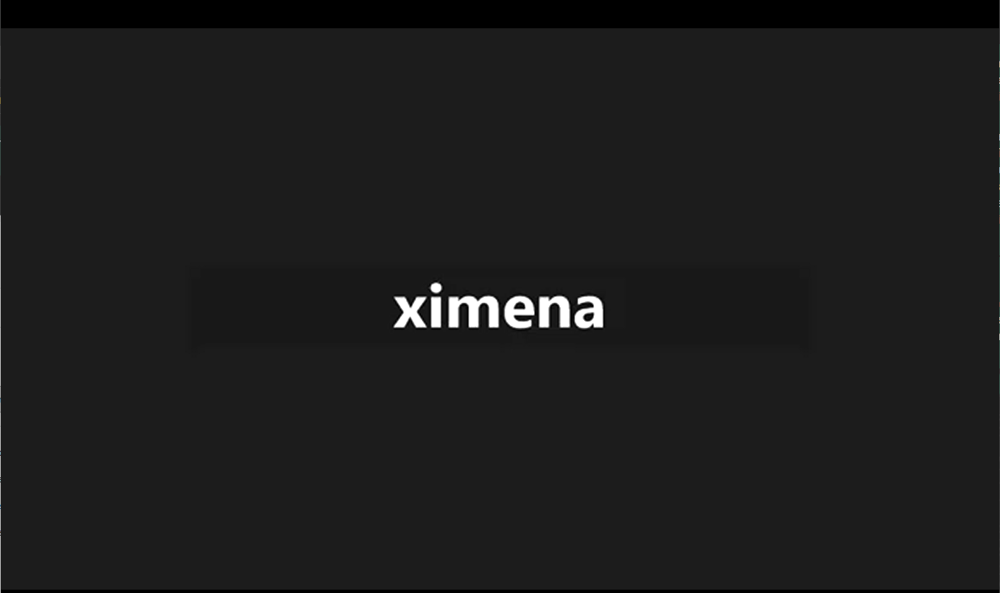

**Minuto de inicio:** 00:01

**Link de la entrevista:**  [Entrevista](https://upcedupe-my.sharepoint.com/:v:/g/personal/u201611430_upc_edu_pe/IQC45k_tuIw-S4SQytMfoJLZAYbUFICw5w4G_0AKRxhUnG4?e=jlKZHb&nav=eyJyZWZlcnJhbEluZm8iOnsicmVmZXJyYWxBcHAiOiJTdHJlYW1XZWJBcHAiLCJyZWZlcnJhbFZpZXciOiJTaGFyZURpYWxvZy1MaW5rIiwicmVmZXJyYWxBcHBQbGF0Zm9ybSI6IldlYiIsInJlZmVycmFsTW9kZSI6InZpZXcifX0%3D)

**Resumen de la entrevista:**

La entrevista revela que Ximena, de 22 años y residente de Villa María, gestiona su granja con un enfoque metódico, pragmático y orientado a resultados, apoyándose fuertemente en el criterio de veterinarios para establecer planes de bioseguridad, vacunación y alimentación que prevengan pérdidas económicas por enfermedades. Actualmente, lleva sus registros de forma manual o en hojas de cálculo, pero busca dar el salto a una aplicación multiplataforma que pueda consultar tanto en campo desde su iPhone como en su laptop Windows a través de Google Chrome. Ella espera que esta herramienta tecnológica le permita automatizar cronogramas, sugerir el uso de medicamentos, controlar el balance financiero y crear fichas individuales para cada animal desde su nacimiento, facilitando así la dosificación exacta de alimento según su etapa de crecimiento y permitiéndole tomar decisiones rápidas y precisas para optimizar su negocio.

### Entrevista 2
**Entrevistado:** Sandro Dincla

**Edad:** 18 años

**Distrito:**

**Minuto de inicio:** 03:25

**Link de la entrevista:** [Entrevista](https://upcedupe-my.sharepoint.com/:v:/g/personal/u201611430_upc_edu_pe/IQC45k_tuIw-S4SQytMfoJLZAYbUFICw5w4G_0AKRxhUnG4?e=jlKZHb&nav=eyJyZWZlcnJhbEluZm8iOnsicmVmZXJyYWxBcHAiOiJTdHJlYW1XZWJBcHAiLCJyZWZlcnJhbFZpZXciOiJTaGFyZURpYWxvZy1MaW5rIiwicmVmZXJyYWxBcHBQbGF0Zm9ybSI6IldlYiIsInJlZmVycmFsTW9kZSI6InZpZXcifX0%3D)

**Resumen de la entrevista:**

La entrevista realizada a Sandro Dincla, de 18 años, revela que participa en la gestión de la granja familiar de aves y cerdos con un enfoque práctico y flexible. Aunque se apoya en veterinarios externos para el cuidado de la salud animal y en mercados locales para la compra de alimentos diferenciados por especie, Sandro lleva actualmente un registro netamente manual en cuadernos sobre las fechas de vacunación y pesaje. Él considera que este método tradicional es su mayor desafío operativo, ya que le genera una importante pérdida de tiempo al realizar el conteo de los animales y buscar información específica en papel. Al realizar la entrevista de forma remota a través de una plataforma de videollamada —lo que demuestra su familiaridad con canales de interacción digitales utilizando una computadora o laptop con cámara, micrófono y navegador web—, expresa su deseo de optimizar sus procesos mediante una aplicación móvil que destaque por su usabilidad y falta de complejidad. Para él, la solución tecnológica ideal debe incluir recordatorios automatizados para vacunas y pesajes, un directorio con números de especialistas (veterinarios y proveedores) siempre disponible para emergencias, y un módulo de alimentación que, si bien le sugiera raciones por animal, le otorgue el control manual para ajustar las cantidades basándose en su propio criterio.

### Entrevista 3
**Entrevistado:** 

**Edad:** 18 años

**Distrito:**

<!-- Aqui colocan un screeshot de la entrevista -->

**Minuto de inicio:** 

**Link de la entrevista:** 

### Segmento #2: Veterinarios Especializados

### Entrevista 1
**Entrevistado:** Johan Bottger

**Edad:** 21

**Distrito:** San Borja

**Minuto de inicio:** 0.01

**Link de la entrevista:** [Entrevista](https://upcedupe-my.sharepoint.com/:v:/g/personal/u202213553_upc_edu_pe/IQA9khWgWmCLSJ91EoFFyW1wATE59FhS_p39VrA7dyI75l0?nav=eyJyZWZlcnJhbEluZm8iOnsicmVmZXJyYWxBcHAiOiJPbmVEcml2ZUZvckJ1c2luZXNzIiwicmVmZXJyYWxBcHBQbGF0Zm9ybSI6IldlYiIsInJlZmVycmFsTW9kZSI6InZpZXciLCJyZWZlcnJhbFZpZXciOiJNeUZpbGVzTGlua0NvcHkifX0&e=mmw8Vb)

**Resumen de la entrevista:**
En la entrevista se muestra como Johan, practicante en una veterianria especializada en el campo, explica cómo lleva a cabo su trabajo. Las dificultades que más suele encontrar son la falta de información clave al momento del diagnóstico, como antecedentes médicos, vacunaciones o cambios en la alimentación. A esto se suma una comunicación poco estructurada con los ganaderos, generalmente a través de aplicaciones de mensajería, donde la información puede perderse o no quedar registrada adecuadamente. El trabajo en zonas rurales presenta además limitaciones técnicas, como la falta de conexión a internet y condiciones adversas que dificultan el registro de datos en tiempo real. Esto impacta directamente en la eficiencia y precisión del servicio. Frente a este contexto, el veterinario valora altamente una solución digital que permita registrar información de manera offline, centralizar historiales clínicos, automatizar el control de tratamientos y mejorar la comunicación con los productores. También considera clave poder compartir indicaciones médicas de forma clara y accesible.

### Entrevista 2
**Entrevistado:** Ricardo Salazar

**Edad:** 25

**Distrito:** Jesus Maria

<!-- Aqui colocan un screeshot de la entrevista -->

**Minuto de inicio:** 00:23

**Link de la entrevista:** [Entrevista](https://upcedupe-my.sharepoint.com/:v:/g/personal/u202516291_upc_edu_pe/IQBanJJimAODQZ7Bf54s97aHAWPNfN7xjsoScvUE6T_-4Ls?e=rSSFa3&nav=eyJyZWZlcnJhbEluZm8iOnsicmVmZXJyYWxBcHAiOiJTdHJlYW1XZWJBcHAiLCJyZWZlcnJhbFZpZXciOiJTaGFyZURpYWxvZy1MaW5rIiwicmVmZXJyYWxBcHBQbGF0Zm9ybSI6IldlYiIsInJlZmVycmFsTW9kZSI6InZpZXcifX0%3D)

**Resumen de la entrevista:**
En la entrevista, Ricardo Salazar, veterinario con 5 años de experiencia, describe cómo realiza su trabajo en el campo. Utiliza cuadernos para anotar en campo y luego traslada la información a Excel para mantener un registro ordenado. También guarda fotos y notas en su celular. Las dificultades principales que enfrenta incluyen la falta de historial clínico completo en las ganaderías, especialmente en datos sobre vacunas y tratamientos previos, lo que dificulta un control efectivo y diagnóstico preciso. La comunicación con los ganaderos se realiza principalmente por llamadas y WhatsApp, con poca frecuencia por correo electrónico, y las visitas se coordinan según la urgencia. En las zonas rurales, la falta de señal y la necesidad de atender solo a los animales complican el registro rápido de datos. Ricardo valora mucho una aplicación veterinaria que permita registrar el historial clínico, controlar vacunas y operar sin conexión a internet para facilitar su trabajo. Prefiere enviar recetas e indicaciones médicas de forma digital, aunque en algunos casos se requieren formatos físicos por la edad de algunos usuarios. Finalmente, destaca que el uso de una plataforma como Bobix ahorra tiempo, organiza mejor la información y permite ofrecer un servicio más preciso a los productores.  

### Entrevista 3
**Entrevistado:**

**Edad:**

**Distrito:**

<!-- Aqui colocan un screeshot de la entrevista -->

**Minuto de inicio:**

**Link de la entrevista:**

### 2.2.3. Análisis de entrevistas

## 2.3. Needfinding
### 2.3.1. User Personas 
Los user persona que se muestran a continuación, fueron realizados a partir de la información recopilada de la sección de entrevistas. Estos nos ayudarán a describir de forma general nuestro segmento objetivo.

- Productores Ganaderos

- Veterinarios Especializados

### 2.3.2. User Task Matrix

En esta sección se presenta el user task matrix de los segmentos objetivos, con el fin de indentificar la frecuencia de las actividades realizadas por los usuarios, y de esta manera se refleja la importancia de determinadas tareas.

<table>
    <thead>
        <tr>
            <th>Task</th>
            <th colspan="2">Productores Ganaderos</th>
            <th colspan="2">Veterinarios Especializados</th>
        </tr>
        <tr>
            <th></th>
            <th>Frecuencia</th>
            <th>Importancia</th>
            <th>Frecuencia</th>
            <th>Importancia</th>
        </tr>
    </thead>
    <tbody>
        <tr>
            <td>Registrar información del ganado</td>
            <td>Alta</td>
            <td>Alta</td>
            <td>Media</td>
            <td>Media</td>
        </tr>
        <tr>
            <td>Monitorear salud de los animales</td>
            <td>Alta</td>
            <td>Alta</td>
            <td>Alta</td>
            <td>Alta</td>
        </tr>
        <tr>
            <td>Detectar enfermedades o anomalías</td>
            <td>Media</td>
            <td>Alta</td>
            <td>Alta</td>
            <td>Alta</td>
        </tr>
        <tr>
            <td>Coordinar atención veterinaria</td>
            <td>Media</td>
            <td>Alta</td>
            <td>Alta</td>
            <td>Alta</td>
        </tr>
        <tr>
            <td>Administrar tratamientos médicos</td>
            <td>Media</td>
            <td>Alta</td>
            <td>Alta</td>
            <td>Alta</td>
        </tr>
        <tr>
            <td>Gestionar alimentación del ganado</td>
            <td>Alta</td>
            <td>Alta</td>
            <td>Baja</td>
            <td>Media</td>
        </tr>
        <tr>
            <td>Controlar reproducción (monta, parto)</td>
            <td>Media</td>
            <td>Alta</td>
            <td>Alta</td>
            <td>Alta</td>
        </tr>
        <tr>
            <td>Evaluar productividad (leche/carne)</td>
            <td>Media</td>
            <td>Alta</td>
            <td>Media</td>
            <td>Media</td>
        </tr>
        <tr>
            <td>Organizar registros e historial</td>
            <td>Media</td>
            <td>Alta</td>
            <td>Alta</td>
            <td>Alta</td>
        </tr>
        <tr>
            <td>Tomar decisiones operativas</td>
            <td>Alta</td>
            <td>Alta</td>
            <td>Alta</td>
            <td>Alta</td>
        </tr>
        <tr>
            <td>Coordinar personal o actividades</td>
            <td>Baja</td>
            <td>Media</td>
            <td>Baja</td>
            <td>Media</td>
        </tr>
        <tr>
            <td>Gestionar múltiples clientes/animales</td>
            <td>Baja</td>
            <td>Media</td>
            <td>Alta</td>
            <td>Alta</td>
        </tr>
    </tbody>
</table>

En base al User Task Matrix presentado, podemos destacar las siguientes tareas con mayor frecuencia e importancia para cada segmento de usuarios:

### Productores Ganaderos:
- Gestionar alimentación	
    - Explicación: La alimentación es la tarea sobre la que más control tienen los productores ganaderos.
- Tomar decisiones operativas	
    - Explicación: La toma de decisiones en muy importante ya que estas afectan al desenvolvimiento del negocio.
### Veterinarios Especializados:
- Monitorear salud de los animales
    - Explicación: Resulta una prioridad para los veterinarios tener un seguimiento del estado de los animales que atienden.
- Administrar tratamientos
    - Explicación: La administración adecuade de los tratamientos es vital paara asegurar el bienestar del animal.

### 2.3.3. User Journey Mapping
En esta sección se presentan los User Journey Mapping de los segmentos objetivos, que realizamos con el fin de dar a entender cómo se siente nuestro usuario en este momento, detallando cada paso que realiza y las emociones que experimenta.

- Productores Ganaderos

- Veterinarios Especializados

### 2.3.4. Empathy Mapping
En esta sección mostramos los empathy mapping de los segmentos objetivos realizados con la información recopilada de componentes anteriores.

- Productores Ganaderos

- Veterinarios Especializados

### 2.3.5. Big Picture EventStorming

### 2.3.6. Ubiquitous Language

-**Animal Health (Salud animal):** Estado físico y fisiológico del ganado, que incluye la prevención, diagnóstico y tratamiento de enfermedades para asegurar su bienestar y productividad.

-**Breeding (Reproducción):** Proceso de cría de animales con el objetivo de mejorar características genéticas, aumentar la productividad y mantener la sostenibilidad del hato.

-**Calving (Parto bovino)** Proceso mediante el cual una vaca da a luz a un ternero, evento clave para el ciclo productivo del ganado.

-**Cattle (Ganado bovino)** Conjunto de animales de la especie bovina criados para la producción de carne, leche u otros productos derivados.

-**Disease Prevention (Prevención de enfermedades)** Conjunto de prácticas orientadas a evitar la aparición de enfermedades en el ganado, incluyendo vacunación, control sanitario y manejo adecuado.

-**Feed Management (Gestión de alimentación)** Planificación, control y suministro de alimentos al ganado para asegurar su nutrición adecuada y maximizar su rendimiento productivo.

-**Herd (Hato / Rebaño)** Grupo de animales de una misma especie que son gestionados como una unidad dentro de una explotación ganadera.

-**Herd Management (Gestión del hato)** Conjunto de actividades relacionadas con el control, monitoreo y optimización del ganado, incluyendo salud, reproducción, alimentación y productividad.

-**Livestock (Ganado)** Término general que engloba a los animales criados para fines productivos, como bovinos, ovinos, caprinos, entre otros.

-**Productivity (Productividad)** Medida del rendimiento del ganado en términos de producción de carne, leche u otros productos, en relación con los recursos utilizados.

-**Traceability (Trazabilidad)** Capacidad de rastrear la historia, ubicación y estado de un animal a lo largo de su vida productiva.

-**Vaccination (Vacunación)** Administración de vacunas para prevenir enfermedades y fortalecer el sistema inmunológico del ganado.

-**Veterinary Care (Atención veterinaria)** Servicios profesionales destinados al diagnóstico, tratamiento y prevención de enfermedades en animales.

-**Animal Welfare (Bienestar animal)** Condición en la que el animal se encuentra sano, cómodo, bien alimentado y libre de sufrimiento innecesario.

-**Farm (Explotación ganadera)** Unidad productiva donde se cría y gestiona el ganado para fines comerciales o de subsistencia.

-**Livestock Monitoring (Monitoreo del ganado)** Seguimiento continuo del estado de los animales, incluyendo salud, ubicación, comportamiento y productividad.

-**Weight Gain (Ganancia de peso)** Incremento del peso corporal del animal en un periodo determinado, indicador clave de su crecimiento y alimentación.

## 2.4. Requirements specification
### 2.4.1. User Stories
Los User Stories representan una herramienta fundamental dentro de las metodologías ágiles para capturar los
requerimientos funcionales desde la perspectiva del usuario. Cada historia describe una necesidad concreta, quién la
necesita y con qué propósito, facilitando la planificación, priorización y desarrollo iterativo del sistema. Esta técnica
garantiza que cada funcionalidad responda a una necesidad real, fomentando un desarrollo orientado al valor y
alineado con las expectativas del usuario final.

<!-- ======================= EP001 ======================= -->

<h2>EP001 — Informarse sobre el Producto</h2>

<table border="1" cellpadding="6" cellspacing="0" width="100%">
  <tr>
    <th>Epic ID</th>
    <th>Título</th>
    <th>Descripción</th>
  </tr>
  <tr>
    <td>EP001</td>
    <td>Informarse sobre el Producto</td>
    <td>
      Como visitante, deseo explorar la landing page de Bovix para conocer sus funcionalidades,
      beneficios y servicios dirigidos al sector ganadero.
    </td>
  </tr>
</table>

 

<!-- US001 -->

<h3>US001</h3>

<table border="1" cellpadding="6" cellspacing="0" width="100%">
  <tr>
    <th>Story ID</th>
    <th>User</th>
    <th>Priority</th>
    <th>Epic</th>
  </tr>

  <tr>
    <td>US001</td>
    <td>Visitante</td>
    <td>Alta</td>
    <td>EP001</td>
  </tr>

  <tr>
    <th colspan="4">Title</th>
  </tr>

  <tr>
    <td colspan="4">Explorar Landing Page</td>
  </tr>

  <tr>
    <th colspan="4">Description</th>
  </tr>

  <tr>
    <td colspan="4">
      Como visitante, quiero explorar la landing page para conocer las funcionalidades y beneficios de Bovix.
    </td>
  </tr>

  <tr>
    <th colspan="4">Acceptance Criteria</th>
  </tr>

  <tr>
    <td colspan="4">
      <b>E01: Visualización de información principal</b> 
      Dado que el visitante accede a la landing page. 
      Cuando navega por las secciones principales. 
      Entonces el sistema muestra información clara sobre Bovix y sus funcionalidades.  

  <b>E02: Navegación entre secciones</b> 
      Dado que el visitante se encuentra en la landing page. 
      Cuando accede a diferentes secciones informativas. 
      Entonces el sistema muestra el contenido correspondiente correctamente.
  </td>
  </tr>
</table>

 

<!-- US002 -->

<h3>US002</h3>

<table border="1" cellpadding="6" cellspacing="0" width="100%">
  <tr>
    <th>Story ID</th>
    <th>User</th>
    <th>Priority</th>
    <th>Epic</th>
  </tr>

  <tr>
    <td>US002</td>
    <td>Visitante</td>
    <td>Alta</td>
    <td>EP001</td>
  </tr>

  <tr>
    <th colspan="4">Title</th>
  </tr>

  <tr>
    <td colspan="4">Visualización de Planes y Beneficios</td>
  </tr>

  <tr>
    <th colspan="4">Description</th>
  </tr>

  <tr>
    <td colspan="4">
      Como visitante, quiero visualizar los planes y beneficios disponibles para evaluar cuál se adapta mejor a mis necesidades.
    </td>
  </tr>

  <tr>
    <th colspan="4">Acceptance Criteria</th>
  </tr>

  <tr>
    <td colspan="4">
      <b>E01: Consulta de planes</b> 
      Dado que el visitante navega por la landing page. 
      Cuando accede a la sección de planes. 
      Entonces el sistema muestra los planes disponibles y sus beneficios.  

  <b>E02: Comparación de funcionalidades</b> 
      Dado que el visitante consulta los planes. 
      Cuando revisa las características de cada uno. 
      Entonces el sistema presenta información comparativa clara y organizada.
  </td>
  </tr>
</table>

 

<!-- US003 -->

<h3>US003</h3>

<table border="1" cellpadding="6" cellspacing="0" width="100%">
  <tr>
    <th>Story ID</th>
    <th>User</th>
    <th>Priority</th>
    <th>Epic</th>
  </tr>

  <tr>
    <td>US003</td>
    <td>Visitante</td>
    <td>Media</td>
    <td>EP001</td>
  </tr>

  <tr>
    <th colspan="4">Title</th>
  </tr>

  <tr>
    <td colspan="4">Contacto con Bovix</td>
  </tr>

  <tr>
    <th colspan="4">Description</th>
  </tr>

  <tr>
    <td colspan="4">
      Como visitante, quiero acceder a información de contacto para comunicarme con el equipo de Bovix.
    </td>
  </tr>

  <tr>
    <th colspan="4">Acceptance Criteria</th>
  </tr>

  <tr>
    <td colspan="4">
      <b>E01: Visualización de información de contacto</b> 
      Dado que el visitante accede a la landing page. 
      Cuando navega a la sección de contacto. 
      Entonces el sistema muestra medios de comunicación disponibles.  

  <b>E02: Envío de consulta</b> 
      Dado que el visitante desea realizar una consulta. 
      Cuando envía información válida mediante el formulario de contacto. 
      Entonces el sistema confirma el envío correctamente.
    </td>
  </tr>
</table>

  

<!-- ======================= EP002 ======================= -->

<h2>EP002 — Gestión de Ganado</h2>

<table border="1" cellpadding="6" cellspacing="0" width="100%">
  <tr>
    <th>Epic ID</th>
    <th>Título</th>
    <th>Descripción</th>
  </tr>

  <tr>
    <td>EP002</td>
    <td>Gestión de Ganado</td>
    <td>
      Como ganadero, deseo registrar y gestionar la información de mis animales
      para mantener un control organizado y actualizado del ganado.
    </td>
  </tr>
</table>

 

<!-- US004 -->

<h3>US004</h3>

<table border="1" cellpadding="6" cellspacing="0" width="100%">
  <tr>
    <th>Story ID</th>
    <th>User</th>
    <th>Priority</th>
    <th>Epic</th>
  </tr>

  <tr>
    <td>US004</td>
    <td>Ganadero</td>
    <td>Alta</td>
    <td>EP002</td>
  </tr>

  <tr>
    <th colspan="4">Title</th>
  </tr>

  <tr>
    <td colspan="4">Registro de Ganado</td>
  </tr>

  <tr>
    <th colspan="4">Description</th>
  </tr>

  <tr>
    <td colspan="4">
      Como ganadero, quiero registrar nuevos animales para mantener un historial actualizado de mi ganado.
    </td>
  </tr>

  <tr>
    <th colspan="4">Acceptance Criteria</th>
  </tr>

  <tr>
    <td colspan="4">
      <b>E01: Registro exitoso de animal</b> 
      Dado que el ganadero se encuentra autenticado. 
      Cuando registra correctamente los datos del animal. 
      Entonces el sistema almacena la información y confirma el registro.  

  <b>E02: Registro incompleto</b> 
      Dado que el ganadero desea registrar un animal. 
      Cuando omite campos obligatorios. 
      Entonces el sistema informa los datos faltantes.  

  <b>E03: Datos inválidos</b> 
      Dado que el ganadero registra información del animal. 
      Cuando ingresa datos inválidos. 
      Entonces el sistema rechaza el registro y muestra un mensaje de error.
    </td>
  </tr>
</table>

 

<!-- US005 -->

<h3>US005</h3>

<table border="1" cellpadding="6" cellspacing="0" width="100%">
  <tr>
    <th>Story ID</th>
    <th>User</th>
    <th>Priority</th>
    <th>Epic</th>
  </tr>

  <tr>
    <td>US005</td>
    <td>Ganadero</td>
    <td>Alta</td>
    <td>EP002</td>
  </tr>

  <tr>
    <th colspan="4">Title</th>
  </tr>

  <tr>
    <td colspan="4">Consulta de Información del Ganado</td>
  </tr>

  <tr>
    <th colspan="4">Description</th>
  </tr>

  <tr>
    <td colspan="4">
      Como ganadero, quiero consultar información de mis animales para acceder rápidamente a sus datos sanitarios y productivos.
    </td>
  </tr>

  <tr>
    <th colspan="4">Acceptance Criteria</th>
  </tr>

  <tr>
    <td colspan="4">
      <b>E01: Consulta exitosa</b> 
      Dado que existen animales registrados. 
      Cuando el ganadero realiza una búsqueda válida. 
      Entonces el sistema muestra los animales encontrados.  

  <b>E02: Sin resultados</b> 
      Dado que el ganadero realiza una búsqueda. 
      Cuando no existen coincidencias. 
      Entonces el sistema informa que no se encontraron registros.
    </td>
  </tr>
</table>

 

<!-- US006 -->

<h3>US006</h3>

<table border="1" cellpadding="6" cellspacing="0" width="100%">
  <tr>
    <th>Story ID</th>
    <th>User</th>
    <th>Priority</th>
    <th>Epic</th>
  </tr>

  <tr>
    <td>US006</td>
    <td>Ganadero</td>
    <td>Media</td>
    <td>EP002</td>
  </tr>

  <tr>
    <th colspan="4">Title</th>
  </tr>

  <tr>
    <td colspan="4">Actualización de Información del Ganado</td>
  </tr>

  <tr>
    <th colspan="4">Description</th>
  </tr>

  <tr>
    <td colspan="4">
      Como ganadero, quiero actualizar la información de mis animales para mantener datos precisos y actualizados.
    </td>
  </tr>

  <tr>
    <th colspan="4">Acceptance Criteria</th>
  </tr>

  <tr>
    <td colspan="4">
      <b>E01: Actualización exitosa</b> 
      Dado que el animal existe en el sistema. 
      Cuando el ganadero modifica correctamente la información. 
      Entonces el sistema actualiza los datos y confirma la operación.  

  <b>E02: Error de validación</b> 
      Dado que el ganadero modifica información del animal. 
      Cuando se ingresan datos inválidos. 
      Entonces el sistema rechaza la actualización y muestra un mensaje descriptivo.
    </td>
  </tr>
</table>

<!-- ======================= EP003 ======================= -->

<h2>EP003 — Monitoreo de Salud y Tratamientos</h2>

<table border="1" cellpadding="6" cellspacing="0" width="100%">
  <tr>
    <th>Epic ID</th>
    <th>Título</th>
    <th>Descripción</th>
  </tr>

  <tr>
    <td>EP003</td>
    <td>Monitoreo de Salud y Tratamientos</td>
    <td>
      Como ganadero y veterinario, deseo monitorear la salud del ganado
      para prevenir enfermedades y mejorar la atención médica de los animales.
    </td>
  </tr>
</table>

 

<!-- US007 -->

<h3>US007</h3>

<table border="1" cellpadding="6" cellspacing="0" width="100%">
  <tr>
    <th>Story ID</th>
    <th>User</th>
    <th>Priority</th>
    <th>Epic</th>
  </tr>

  <tr>
    <td>US007</td>
    <td>Veterinario</td>
    <td>Alta</td>
    <td>EP003</td>
  </tr>

  <tr>
    <th colspan="4">Title</th>
  </tr>

  <tr>
    <td colspan="4">Registro de Tratamientos Médicos</td>
  </tr>

  <tr>
    <th colspan="4">Description</th>
  </tr>

  <tr>
    <td colspan="4">
      Como veterinario, quiero registrar tratamientos médicos para mantener actualizado el historial clínico del animal.
    </td>
  </tr>

  <tr>
    <th colspan="4">Acceptance Criteria</th>
  </tr>

  <tr>
    <td colspan="4">
      <b>E01: Registro exitoso</b> 
      Dado que el veterinario accede al historial clínico. 
      Cuando registra correctamente el tratamiento. 
      Entonces el sistema almacena la información y actualiza el historial.  

  <b>E02: Registro incompleto</b> 
      Dado que el veterinario registra un tratamiento. 
      Cuando omite datos obligatorios. 
      Entonces el sistema informa la información faltante.
    </td>
  </tr>
</table>

 

<!-- US008 -->

<h3>US008</h3>

<table border="1" cellpadding="6" cellspacing="0" width="100%">
  <tr>
    <th>Story ID</th>
    <th>User</th>
    <th>Priority</th>
    <th>Epic</th>
  </tr>

  <tr>
    <td>US008</td>
    <td>Ganadero</td>
    <td>Alta</td>
    <td>EP003</td>
  </tr>

  <tr>
    <th colspan="4">Title</th>
  </tr>

  <tr>
    <td colspan="4">Monitoreo del Estado de Salud</td>
  </tr>

  <tr>
    <th colspan="4">Description</th>
  </tr>

  <tr>
    <td colspan="4">
      Como ganadero, quiero monitorear el estado de salud de mis animales para detectar enfermedades oportunamente.
    </td>
  </tr>

  <tr>
    <th colspan="4">Acceptance Criteria</th>
  </tr>

  <tr>
    <td colspan="4">
      <b>E01: Consulta sanitaria exitosa</b> 
      Dado que existen registros médicos del animal. 
      Cuando el ganadero consulta el historial sanitario. 
      Entonces el sistema muestra el estado de salud actualizado.  

  <b>E02: Animal sin historial clínico</b> 
      Dado que el animal no posee registros médicos. 
      Cuando el ganadero consulta su información sanitaria. 
      Entonces el sistema informa que no existen registros disponibles.
    </td>
  </tr>
</table>

 

<!-- US009 -->

<h3>US009</h3>

<table border="1" cellpadding="6" cellspacing="0" width="100%">
  <tr>
    <th>Story ID</th>
    <th>User</th>
    <th>Priority</th>
    <th>Epic</th>
  </tr>

  <tr>
    <td>US009</td>
    <td>Ganadero</td>
    <td>Alta</td>
    <td>EP003</td>
  </tr>

  <tr>
    <th colspan="4">Title</th>
  </tr>

  <tr>
    <td colspan="4">Generación de Alertas Sanitarias</td>
  </tr>

  <tr>
    <th colspan="4">Description</th>
  </tr>

  <tr>
    <td colspan="4">
      Como ganadero, quiero recibir alertas sanitarias para actuar rápidamente ante riesgos de salud o tratamientos pendientes.
    </td>
  </tr>

  <tr>
    <th colspan="4">Acceptance Criteria</th>
  </tr>

  <tr>
    <td colspan="4">
      <b>E01: Generación automática de alertas</b> 
      Dado que existe una condición sanitaria relevante. 
      Cuando el sistema detecta un evento de riesgo. 
      Entonces se genera una alerta sanitaria.  

  <b>E02: Recordatorio de tratamiento</b> 
      Dado que existe un tratamiento programado. 
      Cuando la fecha de aplicación se aproxima. 
      Entonces el sistema notifica al usuario responsable.
    </td>
  </tr>
</table>

 

<!-- US010 -->

<h3>US010</h3>

<table border="1" cellpadding="6" cellspacing="0" width="100%">
  <tr>
    <th>Story ID</th>
    <th>User</th>
    <th>Priority</th>
    <th>Epic</th>
  </tr>

  <tr>
    <td>US010</td>
    <td>Veterinario</td>
    <td>Media</td>
    <td>EP003</td>
  </tr>

  <tr>
    <th colspan="4">Title</th>
  </tr>

  <tr>
    <td colspan="4">Registro de Diagnósticos Veterinarios</td>
  </tr>

  <tr>
    <th colspan="4">Description</th>
  </tr>

  <tr>
    <td colspan="4">
      Como veterinario, quiero registrar diagnósticos clínicos para mantener un seguimiento médico detallado del ganado.
    </td>
  </tr>

  <tr>
    <th colspan="4">Acceptance Criteria</th>
  </tr>

  <tr>
    <td colspan="4">
      <b>E01: Registro exitoso de diagnóstico</b> 
      Dado que el veterinario selecciona un animal registrado. 
      Cuando ingresa información válida del diagnóstico. 
      Entonces el sistema almacena correctamente el diagnóstico.  

  <b>E02: Error en el registro</b> 
      Dado que el veterinario registra un diagnóstico. 
      Cuando la información es incompleta o inválida. 
      Entonces el sistema rechaza el registro y muestra un mensaje descriptivo.
    </td>
  </tr>
</table>

  

<!-- ======================= EP004 ======================= -->

<h2>EP004 — Gestión de Alimentación y Reproducción</h2>

<table border="1" cellpadding="6" cellspacing="0" width="100%">
  <tr>
    <th>Epic ID</th>
    <th>Título</th>
    <th>Descripción</th>
  </tr>

  <tr>
    <td>EP004</td>
    <td>Gestión de Alimentación y Reproducción</td>
    <td>
      Como ganadero, deseo gestionar la alimentación y reproducción del ganado
      para mejorar la productividad y bienestar animal.
    </td>
  </tr>
</table>

 

<!-- US011 -->

<h3>US011</h3>

<table border="1" cellpadding="6" cellspacing="0" width="100%">
  <tr>
    <th>Story ID</th>
    <th>User</th>
    <th>Priority</th>
    <th>Epic</th>
  </tr>

  <tr>
    <td>US011</td>
    <td>Ganadero</td>
    <td>Alta</td>
    <td>EP004</td>
  </tr>

  <tr>
    <th colspan="4">Title</th>
  </tr>

  <tr>
    <td colspan="4">Registro de Alimentación</td>
  </tr>

  <tr>
    <th colspan="4">Description</th>
  </tr>

  <tr>
    <td colspan="4">
      Como ganadero, quiero registrar la alimentación del ganado para controlar el consumo y mejorar la productividad.
    </td>
  </tr>

  <tr>
    <th colspan="4">Acceptance Criteria</th>
  </tr>

  <tr>
    <td colspan="4">
      <b>E01: Registro exitoso de alimentación</b> 
      Dado que el ganadero accede al módulo correspondiente. 
      Cuando registra información válida de alimentación. 
      Entonces el sistema almacena correctamente el registro.  

  <b>E02: Registro inválido</b> 
      Dado que el ganadero registra información de alimentación. 
      Cuando los datos ingresados son incorrectos. 
      Entonces el sistema rechaza el registro y muestra un mensaje de error.
    </td>
  </tr>
</table>

 

<!-- US012 -->

<h3>US012</h3>

<table border="1" cellpadding="6" cellspacing="0" width="100%">
  <tr>
    <th>Story ID</th>
    <th>User</th>
    <th>Priority</th>
    <th>Epic</th>
  </tr>

  <tr>
    <td>US012</td>
    <td>Ganadero</td>
    <td>Alta</td>
    <td>EP004</td>
  </tr>

  <tr>
    <th colspan="4">Title</th>
  </tr>

  <tr>
    <td colspan="4">Registro de Eventos Reproductivos</td>
  </tr>

  <tr>
    <th colspan="4">Description</th>
  </tr>

  <tr>
    <td colspan="4">
      Como ganadero, quiero registrar eventos reproductivos para realizar seguimiento de la reproducción del ganado.
    </td>
  </tr>

  <tr>
    <th colspan="4">Acceptance Criteria</th>
  </tr>

  <tr>
    <td colspan="4">
      <b>E01: Registro exitoso de evento reproductivo</b> 
      Dado que el ganadero selecciona un animal registrado. 
      Cuando registra un evento reproductivo válido. 
      Entonces el sistema almacena correctamente la información.  

  <b>E02: Registro incompleto</b> 
      Dado que el usuario registra un evento reproductivo. 
      Cuando faltan datos obligatorios. 
      Entonces el sistema informa la información faltante.
    </td>
  </tr>
</table>

 

<!-- US013 -->

<h3>US013</h3>

<table border="1" cellpadding="6" cellspacing="0" width="100%">
  <tr>
    <th>Story ID</th>
    <th>User</th>
    <th>Priority</th>
    <th>Epic</th>
  </tr>

  <tr>
    <td>US013</td>
    <td>Veterinario</td>
    <td>Media</td>
    <td>EP004</td>
  </tr>

  <tr>
    <th colspan="4">Title</th>
  </tr>

  <tr>
    <td colspan="4">Seguimiento Reproductivo</td>
  </tr>

  <tr>
    <th colspan="4">Description</th>
  </tr>

  <tr>
    <td colspan="4">
      Como veterinario, quiero visualizar el seguimiento reproductivo de los animales para evaluar su estado y evolución.
    </td>
  </tr>

  <tr>
    <th colspan="4">Acceptance Criteria</th>
  </tr>

  <tr>
    <td colspan="4">
      <b>E01: Visualización de seguimiento</b> 
      Dado que existen registros reproductivos. 
      Cuando el veterinario consulta el historial correspondiente. 
      Entonces el sistema muestra información actualizada del animal.
    </td>
  </tr>
</table>

<!-- ======================= EP005 ======================= -->

<h2>EP005 — Atención Veterinaria</h2>

<table border="1" cellpadding="6" cellspacing="0" width="100%">
  <tr>
    <th>Epic ID</th>
    <th>Título</th>
    <th>Descripción</th>
  </tr>

  <tr>
    <td>EP005</td>
    <td>Atención Veterinaria</td>
    <td>
      Como ganadero y veterinario, deseo coordinar la atención médica de los animales
      para mejorar el seguimiento sanitario y la comunicación entre usuarios.
    </td>
  </tr>
</table>

 

<!-- US014 -->

<h3>US014</h3>

<table border="1" cellpadding="6" cellspacing="0" width="100%">
  <tr>
    <th>Story ID</th>
    <th>User</th>
    <th>Priority</th>
    <th>Epic</th>
  </tr>

  <tr>
    <td>US014</td>
    <td>Ganadero</td>
    <td>Alta</td>
    <td>EP005</td>
  </tr>

  <tr>
    <th colspan="4">Title</th>
  </tr>

  <tr>
    <td colspan="4">Solicitud de Atención Veterinaria</td>
  </tr>

  <tr>
    <th colspan="4">Description</th>
  </tr>

  <tr>
    <td colspan="4">
      Como ganadero, quiero solicitar atención veterinaria para recibir asistencia médica para mis animales.
    </td>
  </tr>

  <tr>
    <th colspan="4">Acceptance Criteria</th>
  </tr>

  <tr>
    <td colspan="4">
      <b>E01: Solicitud exitosa</b> 
      Dado que el ganadero accede al módulo veterinario. 
      Cuando registra correctamente la solicitud. 
      Entonces el sistema almacena la solicitud y confirma el proceso.  

  <b>E02: Solicitud inválida</b> 
      Dado que el ganadero registra la solicitud. 
      Cuando faltan datos obligatorios. 
      Entonces el sistema informa los campos pendientes.
    </td>
  </tr>
</table>

 

<!-- US015 -->

<h3>US015</h3>

<table border="1" cellpadding="6" cellspacing="0" width="100%">
  <tr>
    <th>Story ID</th>
    <th>User</th>
    <th>Priority</th>
    <th>Epic</th>
  </tr>

  <tr>
    <td>US015</td>
    <td>Veterinario</td>
    <td>Media</td>
    <td>EP005</td>
  </tr>

  <tr>
    <th colspan="4">Title</th>
  </tr>

  <tr>
    <td colspan="4">Compartir Historial Clínico</td>
  </tr>

  <tr>
    <th colspan="4">Description</th>
  </tr>

  <tr>
    <td colspan="4">
      Como veterinario, quiero acceder y compartir el historial clínico del ganado para mejorar la atención médica y el seguimiento sanitario.
    </td>
  </tr>

  <tr>
    <th colspan="4">Acceptance Criteria</th>
  </tr>

  <tr>
    <td colspan="4">
      <b>E01: Consulta de historial clínico</b> 
      Dado que el animal posee historial médico registrado. 
      Cuando el veterinario accede a la información. 
      Entonces el sistema muestra el historial clínico actualizado.  

  <b>E02: Compartir historial médico</b> 
      Dado que el veterinario consulta la información clínica. 
      Cuando comparte el historial con el ganadero autorizado. 
      Entonces el sistema permite visualizar la información correctamente.
    </td>
  </tr>
</table>

  

<!-- ======================= EP006 ======================= -->

<h2>EP006 — Reportes y Toma de Decisiones</h2>

<table border="1" cellpadding="6" cellspacing="0" width="100%">
  <tr>
    <th>Epic ID</th>
    <th>Título</th>
    <th>Descripción</th>
  </tr>

  <tr>
    <td>EP006</td>
    <td>Reportes y Toma de Decisiones</td>
    <td>
      Como ganadero, deseo visualizar reportes y estadísticas para mejorar
      la toma de decisiones relacionadas con mi operación ganadera.
    </td>
  </tr>
</table>

 

<!-- US016 -->

<h3>US016</h3>

<table border="1" cellpadding="6" cellspacing="0" width="100%">
  <tr>
    <th>Story ID</th>
    <th>User</th>
    <th>Priority</th>
    <th>Epic</th>
  </tr>

  <tr>
    <td>US016</td>
    <td>Ganadero</td>
    <td>Media</td>
    <td>EP006</td>
  </tr>

  <tr>
    <th colspan="4">Title</th>
  </tr>

  <tr>
    <td colspan="4">Visualización de Reportes Productivos</td>
  </tr>

  <tr>
    <th colspan="4">Description</th>
  </tr>

  <tr>
    <td colspan="4">
      Como ganadero, quiero visualizar reportes productivos para evaluar el rendimiento del ganado.
    </td>
  </tr>

  <tr>
    <th colspan="4">Acceptance Criteria</th>
  </tr>

  <tr>
    <td colspan="4">
      <b>E01: Generación de reportes</b> 
      Dado que existen registros productivos disponibles. 
      Cuando el ganadero solicita un reporte. 
      Entonces el sistema genera información consolidada del ganado.  

  <b>E02: Reporte sin datos suficientes</b> 
      Dado que el usuario solicita un reporte productivo. 
      Cuando no existen datos registrados suficientes. 
      Entonces el sistema informa que no es posible generar el reporte.
    </td>
  </tr>
</table>

 

<!-- US017 -->

<h3>US017</h3>

<table border="1" cellpadding="6" cellspacing="0" width="100%">
  <tr>
    <th>Story ID</th>
    <th>User</th>
    <th>Priority</th>
    <th>Epic</th>
  </tr>

  <tr>
    <td>US017</td>
    <td>Ganadero</td>
    <td>Media</td>
    <td>EP006</td>
  </tr>

  <tr>
    <th colspan="4">Title</th>
  </tr>

  <tr>
    <td colspan="4">Consulta de Estadísticas Sanitarias</td>
  </tr>

  <tr>
    <th colspan="4">Description</th>
  </tr>

  <tr>
    <td colspan="4">
      Como ganadero, quiero consultar estadísticas sanitarias para identificar patrones relacionados con la salud del ganado.
    </td>
  </tr>

  <tr>
    <th colspan="4">Acceptance Criteria</th>
  </tr>

  <tr>
    <td colspan="4">
      <b>E01: Visualización de estadísticas</b> 
      Dado que existen datos sanitarios registrados. 
      Cuando el usuario consulta estadísticas. 
      Entonces el sistema muestra información consolidada y actualizada.  

  <b>E02: Estadísticas sin registros</b> 
      Dado que el usuario consulta información sanitaria. 
      Cuando no existen datos registrados. 
      Entonces el sistema informa que no hay estadísticas disponibles.
    </td>
  </tr>
</table>

  

<!-- ======================= EP007 ======================= -->

<h2>EP007 — APIs y Servicios Backend</h2>

<table border="1" cellpadding="6" cellspacing="0" width="100%">
  <tr>
    <th>Epic ID</th>
    <th>Título</th>
    <th>Descripción</th>
  </tr>

  <tr>
    <td>EP007</td>
    <td>APIs y Servicios Backend</td>
    <td>
      Como developer, deseo implementar servicios backend y APIs REST
      para soportar las funcionalidades de la plataforma Bovix.
    </td>
  </tr>
</table>

 

<!-- TS001 -->

<h3>TS001</h3>

<table border="1" cellpadding="6" cellspacing="0" width="100%">
  <tr>
    <th>Story ID</th>
    <th>User</th>
    <th>Priority</th>
    <th>Epic</th>
  </tr>

  <tr>
    <td>TS001</td>
    <td>Developer</td>
    <td>Alta</td>
    <td>EP007</td>
  </tr>

  <tr>
    <th colspan="4">Title</th>
  </tr>

  <tr>
    <td colspan="4">API para Registro de Ganado</td>
  </tr>

  <tr>
    <th colspan="4">Description</th>
  </tr>

  <tr>
    <td colspan="4">
      Como developer, necesito implementar un endpoint para registrar animales dentro de la plataforma Bovix.
    </td>
  </tr>

  <tr>
    <th colspan="4">Acceptance Criteria</th>
  </tr>

  <tr>
    <td colspan="4">
      <b>E01: Registro exitoso</b> 
      Dado que el endpoint /ganado está disponible. 
      Cuando se envía una solicitud POST con datos válidos. 
      Entonces se recibe una respuesta 201 (Created).  

  <b>E02: Datos inválidos</b> 
      Dado que el endpoint /ganado está disponible. 
      Cuando se envía información incompleta o incorrecta. 
      Entonces se recibe una respuesta 400 (Bad Request).
    </td>
  </tr>
</table>

 

<!-- TS002 -->

<h3>TS002</h3>

<table border="1" cellpadding="6" cellspacing="0" width="100%">
  <tr>
    <th>Story ID</th>
    <th>User</th>
    <th>Priority</th>
    <th>Epic</th>
  </tr>

  <tr>
    <td>TS002</td>
    <td>Developer</td>
    <td>Alta</td>
    <td>EP007</td>
  </tr>

  <tr>
    <th colspan="4">Title</th>
  </tr>

  <tr>
    <td colspan="4">API para Consulta de Ganado</td>
  </tr>

  <tr>
    <th colspan="4">Description</th>
  </tr>

  <tr>
    <td colspan="4">
      Como developer, necesito implementar endpoints de consulta para obtener información del ganado registrado.
    </td>
  </tr>

  <tr>
    <th colspan="4">Acceptance Criteria</th>
  </tr>

  <tr>
    <td colspan="4">
      <b>E01: Consulta exitosa</b> 
      Dado que el endpoint /ganado está disponible. 
      Cuando se realiza una solicitud GET válida. 
      Entonces se recibe una respuesta 200 (OK) con los registros encontrados.  

  <b>E02: Sin resultados</b> 
      Dado que el endpoint /ganado está disponible. 
      Cuando no existen coincidencias en la búsqueda. 
      Entonces el sistema devuelve una lista vacía o un mensaje informativo.
    </td>
  </tr>
</table>

<!-- ======================= EP008 ======================= -->

<h2>EP008 — Investigación y Validación Técnica</h2>

<table border="1" cellpadding="6" cellspacing="0" width="100%">
  <tr>
    <th width="20%">Epic ID</th>
    <th width="30%">Título</th>
    <th width="50%">Descripción</th>
  </tr>
  <tr>
    <td>EP008</td>
    <td>Investigación y Validación Técnica</td>
    <td>
      Como developer, deseo investigar soluciones tecnológicas que permitan garantizar
      el funcionamiento eficiente de Bovix en entornos rurales y de baja conectividad.
    </td>
  </tr>
</table>

 

<!-- ======================= SP001 ======================= -->

<h3>SP001</h3>

<table border="1" cellpadding="6" cellspacing="0" width="100%">

  <tr>
    <th>Story ID</th>
    <th>User</th>
    <th>Priority</th>
    <th>Epic</th>
  </tr>

  <tr>
    <td>SP001</td>
    <td>Developer</td>
    <td>Alta</td>
    <td>EP008</td>
  </tr>

  <tr>
    <th colspan="4">Title</th>
  </tr>

  <tr>
    <td colspan="4">
      Investigación sobre Arquitectura Offline
    </td>
  </tr>

  <tr>
    <th colspan="4">Description</th>
  </tr>

  <tr>
    <td colspan="4">
      Como developer, necesito investigar tecnologías offline para garantizar el
      funcionamiento de la aplicación en zonas rurales con baja conectividad.
    </td>
  </tr>

  <tr>
    <th colspan="4">Acceptance Criteria</th>
  </tr>

  <tr>
    <td colspan="4">

  <b>E01: Investigación de tecnologías</b> 
      Dado que el equipo requiere operar en entornos rurales. 
      Cuando se analizan tecnologías compatibles con funcionamiento offline. 
      Entonces se documentan las alternativas viables para la aplicación.  

  <b>E02: Comparación técnica</b> 
      Dado que existen múltiples tecnologías disponibles. 
      Cuando se comparan sus ventajas y limitaciones. 
      Entonces el equipo identifica la arquitectura más adecuada para Bovix.  

  <b>E03: Documentación de resultados</b> 
      Dado que finaliza la investigación técnica. 
      Cuando se consolidan las conclusiones obtenidas. 
      Entonces el equipo genera un documento con recomendaciones técnicas.

  </td>
  </tr>

</table>

  

<!-- ======================= SP002 ======================= -->

<h3>SP002</h3>

<table border="1" cellpadding="6" cellspacing="0" width="100%">

  <tr>
    <th>Story ID</th>
    <th>User</th>
    <th>Priority</th>
    <th>Epic</th>
  </tr>

  <tr>
    <td>SP002</td>
    <td>Developer</td>
    <td>Alta</td>
    <td>EP008</td>
  </tr>

  <tr>
    <th colspan="4">Title</th>
  </tr>

  <tr>
    <td colspan="4">
      Investigación sobre Sincronización de Datos
    </td>
  </tr>

  <tr>
    <th colspan="4">Description</th>
  </tr>

  <tr>
    <td colspan="4">
      Como developer, necesito analizar mecanismos de sincronización para mantener
      la consistencia de información entre dispositivos y servidor.
    </td>
  </tr>

  <tr>
    <th colspan="4">Acceptance Criteria</th>
  </tr>

  <tr>
    <td colspan="4">

  <b>E01: Evaluación de sincronización</b> 
      Dado que la aplicación puede funcionar sin conexión. 
      Cuando se restablece la conectividad. 
      Entonces los datos almacenados localmente deben sincronizarse correctamente.  

  <b>E02: Análisis de conflictos</b> 
      Dado que pueden existir modificaciones simultáneas. 
      Cuando ocurre un conflicto de información. 
      Entonces se identifican mecanismos de resolución adecuados.  

  <b>E03: Validación técnica</b> 
      Dado que concluye el análisis de sincronización. 
      Cuando el equipo revisa los resultados obtenidos. 
      Entonces se documentan conclusiones y recomendaciones técnicas.

  </td>
  </tr>

</table>

  

<!-- ======================= SP003 ======================= -->

<h3>SP003</h3>

<table border="1" cellpadding="6" cellspacing="0" width="100%">

  <tr>
    <th>Story ID</th>
    <th>User</th>
    <th>Priority</th>
    <th>Epic</th>
  </tr>

  <tr>
    <td>SP003</td>
    <td>Developer</td>
    <td>Media</td>
    <td>EP008</td>
  </tr>

  <tr>
    <th colspan="4">Title</th>
  </tr>

  <tr>
    <td colspan="4">
      Evaluación de Notificaciones y Alertas
    </td>
  </tr>

  <tr>
    <th colspan="4">Description</th>
  </tr>

  <tr>
    <td colspan="4">
      Como developer, necesito evaluar mecanismos de notificaciones para garantizar
      la entrega de alertas sanitarias en tiempo real.
    </td>
  </tr>

  <tr>
    <th colspan="4">Acceptance Criteria</th>
  </tr>

  <tr>
    <td colspan="4">

  <b>E01: Evaluación de servicios de notificación</b> 
      Dado que Bovix requiere enviar alertas sanitarias. 
      Cuando se investigan servicios de notificaciones compatibles. 
      Entonces el equipo identifica soluciones viables para la plataforma.  

  <b>E02: Validación de alertas</b> 
      Dado que se realizan pruebas de notificaciones. 
      Cuando ocurre un evento sanitario importante. 
      Entonces el sistema debe ser capaz de generar alertas oportunas.  

  <b>E03: Documentación de resultados</b> 
      Dado que finaliza la evaluación técnica. 
      Cuando el equipo consolida la información obtenida. 
      Entonces se documentan las conclusiones y recomendaciones de implementación.

  </td>
  </tr>

</table>

### 2.4.2. Impact Mapping

A continuación presentaremos 2 Business Goals que consideramos importantes en nuestro proyecto:

#### Impact Map 1

#### Impact Map 2

### 2.4.3. Product Backlog
El Product Backlog es un elemento esencial en la gestión ágil de proyectos, ya que representa una lista priorizada de
funcionalidades, mejoras y tareas necesarias para el desarrollo del producto. Este backlog fue construido a partir de las
necesidades identificadas en las entrevistas, el To-Be Scenario Mapping y las User Stories, permitiendo organizar y
planificar el trabajo del equipo de forma estructurada y alineada con los objetivos del proyecto. Cada ítem del backlog
está enfocado en generar valor para el usuario final y facilitar una entrega incremental y efectiva de la solución.

| Orden | User Story ID | Título | Story Points |
|--------|----------------|---------|---------------|
| 1 | US001 | Explorar Landing Page | 2 |
| 2 | US002 | Visualización de Planes y Beneficios | 2 |
| 3 | US003 | Contacto con Bovix | 1 |
| 4 | US004 | Registro de Ganado | 5 |
| 5 | US005 | Consulta de Información del Ganado | 3 |
| 6 | US007 | Historial Individual del Animal | 3 |
| 7 | US008 | Registro de Tratamientos Médicos | 5 |
| 8 | US009 | Monitoreo del Estado de Salud | 5 |
| 9 | US010 | Generación de Alertas Sanitarias | 5 |
| 10 | US012 | Registro de Alimentación | 3 |
| 11 | US013 | Registro de Eventos Reproductivos | 3 |
| 12 | US015 | Solicitud de Atención Veterinaria | 3 |
| 13 | US016 | Compartir Historial Clínico | 3 |
| 14 | US017 | Visualización de Reportes Productivos | 2 |
| 15 | US018 | Consulta de Estadísticas Sanitarias | 2 |
| 16 | TS001 | API para Registro de Ganado | 5 |
| 17 | TS002 | API para Consulta de Ganado | 3 |
| 18 | TS003 | API para Gestión de Tratamientos | 5 |
| 19 | TS004 | API para Gestión de Alimentación | 3 |
| 20 | TS005 | API para Gestión Reproductiva | 3 |
| 21 | TS006 | API para Atención Veterinaria | 3 |
| 22 | TS007 | API para Reportes y Estadísticas | 2 |
| 23 | SP001 | Investigación sobre Arquitectura Offline | 2 |
| 24 | SP002 | Investigación sobre Sincronización de Datos | 2 |
| 25 | SP003 | Evaluación de Notificaciones y Alertas | 2 |

Referencia Url: https://trello.com/invite/b/69eb18faf9cfe282325fc7cf/ATTI73c118c2876f1a867d9e4232056eedadE5E6036F/product-backlog

## 2.5. Strategic-Level Domain-Driven Design
### 2.5.1. EventStorming

Con el fin de plantear una aproximación del modelado de nivel general para el dominio del problema, se aplicó la técnica de EventStorming. Este proceso permitió al equipo comprender el flujo de eventos que ocurren dentro del dominio y definir las interacciones principales entre los actores, comandos y políticas del sistema.

Pasos del proceso:

1. Eventos de Dominio (Tormenta de ideas): Identificar qué ha sucedido en el negocio, usando notas adhesivas naranjas escritas en pasado

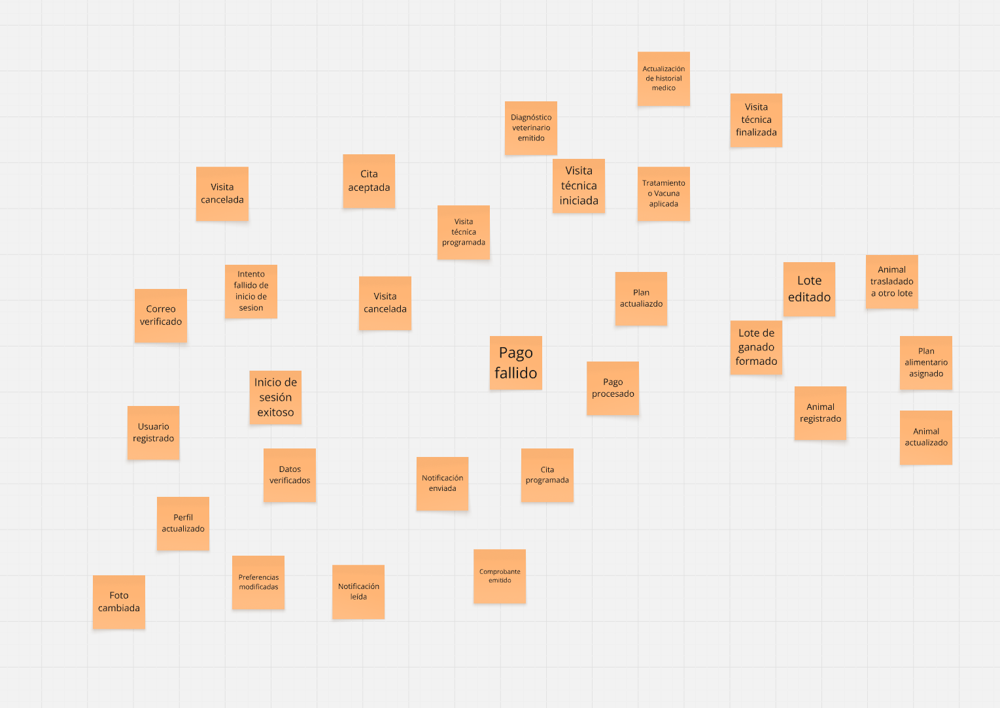

2. Ordenar Eventos: Organizar los eventos cronológicamente de izquierda a derecha, eliminando duplicados.

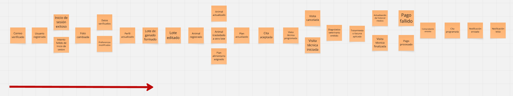

3. Identificar Comandos (Acciones): Añadir notas azules que representan acciones que provocan los eventos.

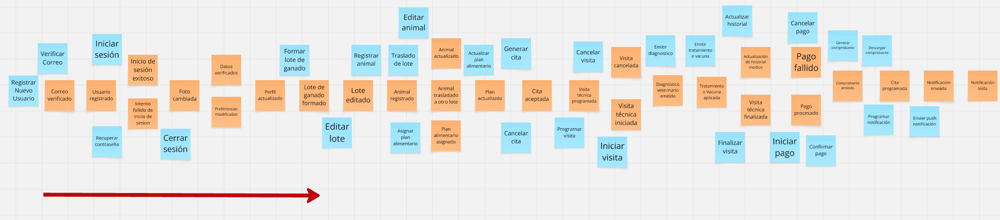

4. Actores y Sistemas: Determinar quién realiza la acción (persona) o qué sistema externo (API, pago) participa.

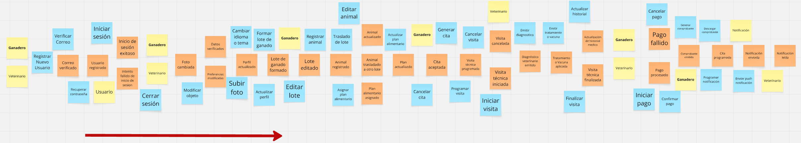

5. Políticas (Reglas de Negocio): Identificar reacciones automáticas o reglas que siguen a un evento, usando notas moradas

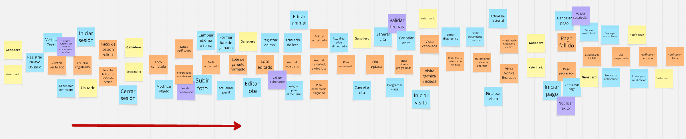

 6. Agregados y Contextos Delimitados: Agrupar comandos y eventos relacionados para definir límites lógicos o microservicios.

 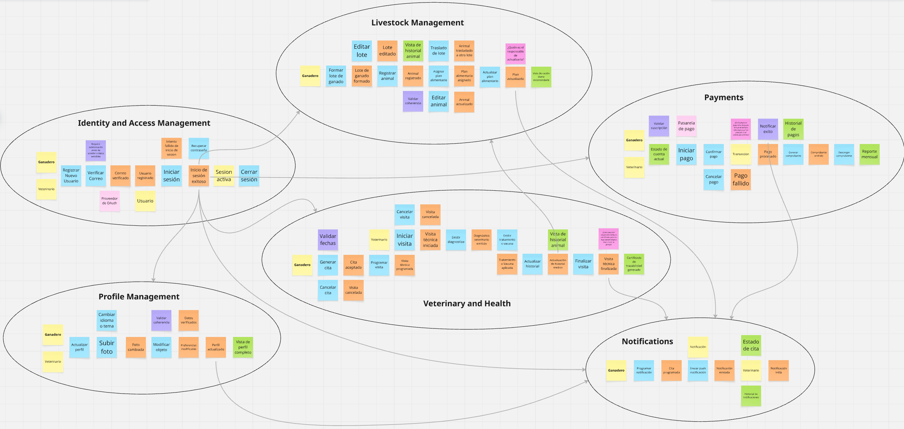

### 2.5.1.1. Candidate Context Discovery

Para poder identificar los bounded contexts se tuvo que modificar la línea de tiempo del modelado del dominio que se hizo a partir del EventStorming, se organizaron los conceptos que tenían relación.

**Bounded Context Identity and Access Management**

Se encarga de la seguridad y el control de acceso. Gestiona el registro de nuevos usuarios, la verificación de correos, el inicio de sesión (incluyendo integraciones con proveedores de OAuth) y el mantenimiento de sesiones activas tanto para ganaderos como para veterinarios

**Bounded Context Profile Management**

Su objetivo es la personalización de la experiencia del usuario. Permite actualizar el perfil, subir fotos, modificar preferencias y asegurar que los datos del usuario estén validados para mostrar una vista de perfil completo
.

**Bounded Context Livestock Management**

Se centra en el control del inventario animal. Permite formar lotes de ganado, registrar animales individualmente y gestionar sus traslados. Además, es responsable de asignar y actualizar planes alimentarios para generar la ración diaria recomendada
.

**Bounded Context Veterinary and Health**

Es el núcleo clínico de la aplicación. Gestiona todo el proceso de salud animal, desde generar citas y programar visitas técnicas, hasta la emisión de diagnósticos, tratamientos y vacunas, culminando en la generación de certificados de trazabilidad
.

**Bounded Context Payments**

Administra la parte financiera de los servicios. Maneja el flujo de inicio y confirmación de pagos a través de pasarelas, gestiona el historial de transacciones, valida suscripciones y permite la descarga de comprobantes y reportes mensuales
.

**Bounded Context Notifications**

Actúa como el canal de comunicación directa con el usuario. Su función es programar y enviar notificaciones push basadas en eventos del sistema, como citas programadas o cambios en el estado de las mismas, manteniendo un historial para consulta del usuario
.

### 2.5.1.2. Domain Message Flows Modeling

En esta sección se muestran los principales flujos identificados donde existe colaboración entre los diferentes bounded context identificador. Para una mayor comprensión se utiliza la técnica de visualización Domain Storytelling.

**Nuevo registro de usuario y configuracion inicial del perfil**

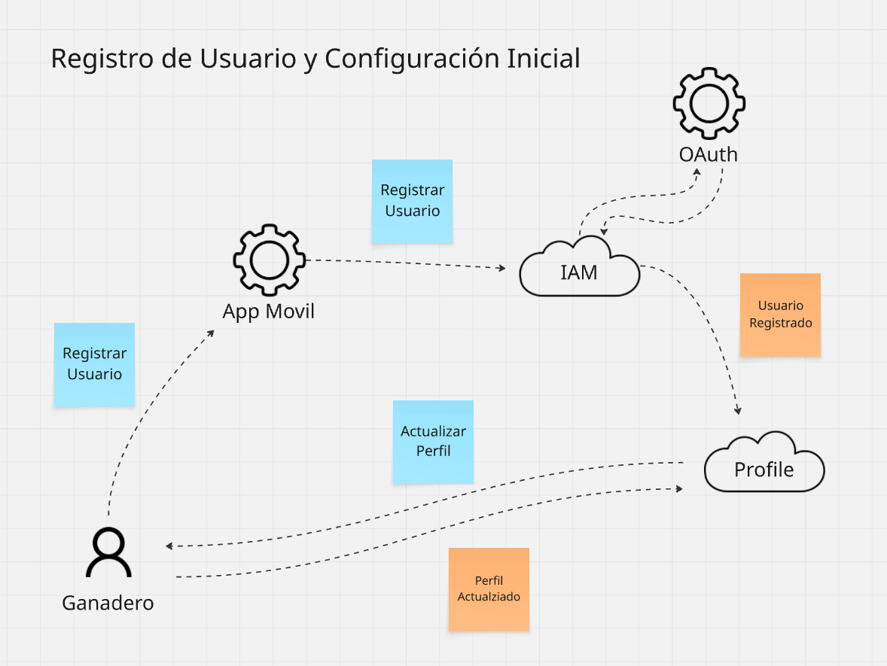

**Programacion de visita por parte de un ganadero y su gestion de pago**

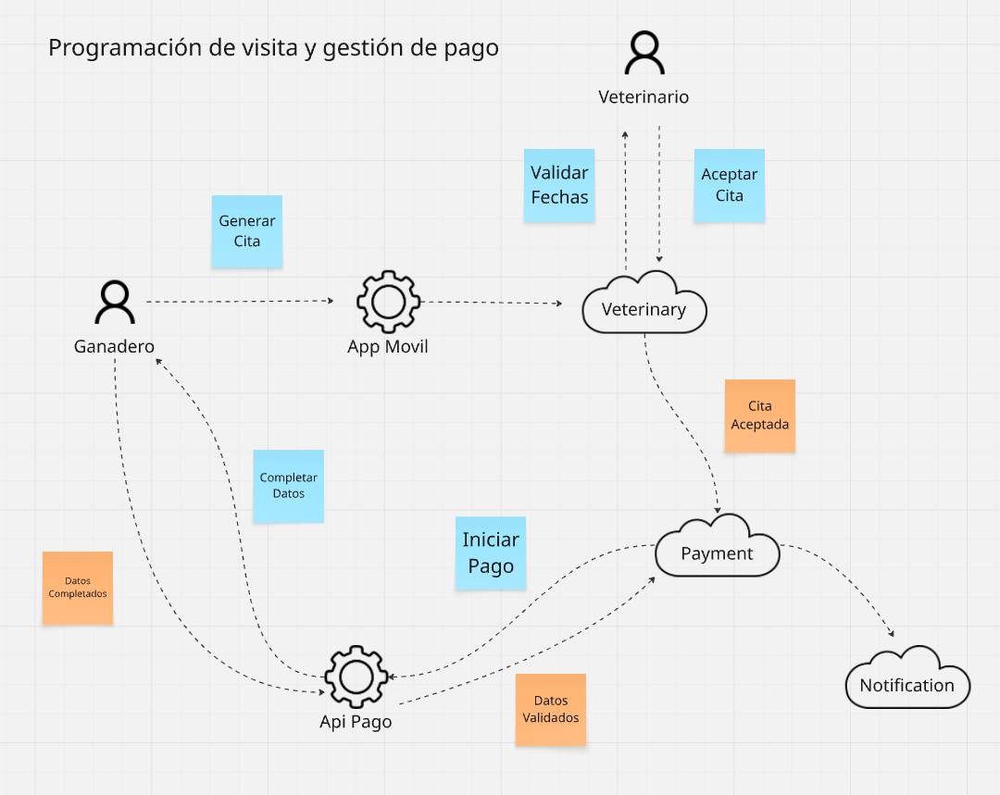

**Actualizacion de plan alimentario luego de un diagnostico**

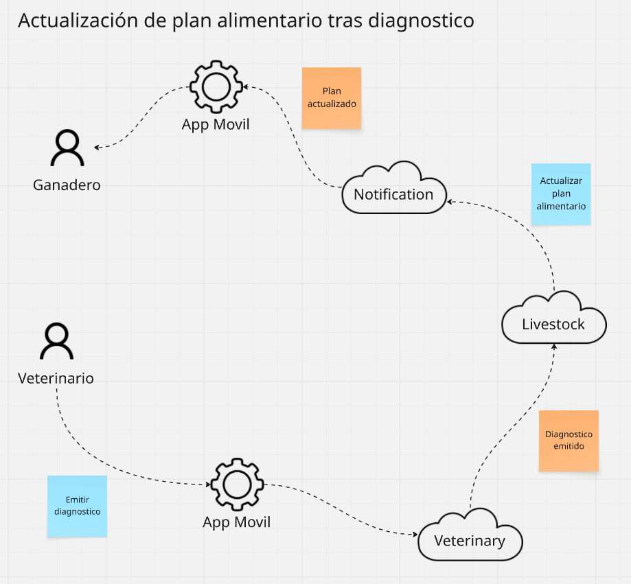

### 2.5.1.3. Bounded Context Canvases

Para la presente sección, elaboramos el Bounded Context Canvas de cada uno de los Bounded Context candidatos que identificamos. Aplicamos el modelo versión 5 propuesto por el Domain Driven Design Group. En cada uno de los canvases registramos las secciones específicas como el Context Overview Definition, Business Rules Distillation y el Ubiquitous Language, identificando claramente el tipo de Bounded Context y sus interacciones de entrada y salida con otros contextos.

**Bounded Context Identity and Access Management**

**Bounded Context Profile Management**

**Bounded Context Livestock Management**

**Bounded Context Veterinary and Health**

**Bounded Context Payments**

**Bounded Context Notifications**

### 2.5.2. Context Mapping

En el context mapping podemos definir las relaciones entre los bounded context.

El mapa de contexto se articula mediante IAM Management
, que actúa como Upstream al emitir el evento de registro necesario para que Profile Management
 inicialice la identidad del usuario, sirviendo este último como Open Host Service para proveer datos biográficos a toda la plataforma. Los dominios principales, Veterinary and Health
 y Livestock Management
, están integrados mediante un Shared Kernel, lo que permite que los diagnósticos clínicos emitidos por el veterinario coordinen directamente la actualización de los planes alimentarios y la ración diaria recomendada para el ganado. Finalmente, Payments
 mantiene una relación de Customer-Supplier con el área veterinaria para procesar transacciones tras la programación de citas, mientras que Notifications
 funciona de manera transversal como un consumidor Downstream que reacciona a los eventos de éxito de todos los contextos para mantener informados a ganaderos y veterinarios.

### 2.5.3. Software Architecture
### 2.5.3.1. Software Architecture Context Level Diagrams

En el software architecture context diagram se puede apreciar los componentes mas importantes que componen el sistema,asi como los usuarios y las principales funciones.

### 2.5.3.2. Software Architecture Container Level Diagrams

En el software architecture container diagram se puede apreciar la forma de más alto nivel de la arquitectura del software y como se distribuyen las responsabilidades en ella.También muestra las principales opciones tecnológicas y cómo los contenedores se comunican entre sí.

### 2.5.3.3. Software Architecture Deployment Diagrams

Este diagrama sirve para mapear la arquitectura física del sistema, visualizando cómo se distribuyen los artefactos de software en los nodos de hardware y sus rutas de comunicación.

## 2.6. Tactical-Level Domain-Driven Design
## 2.6.1. Bounded Context: Identity and Access Management
### 2.6.1.1. Domain Layer
Este bounded context gestiona el ciclo de vida de la identidad del usuario: registro, verificación, autenticación y cierre de sesión. Los actores son Ganadero y Veterinario.

**Entities:**
- **User:**
  - Propósito: Representa a cualquier usuario del sistema, independiemente de su rol.
  - Atributos: id: UUID, email: Email (VO), passwordHash: String, role: UserRole (Enum), isVerified: Boolean, createdAt: DateTime, lastLogin: DateTime
  - Métodos: verifyEmail(), login(password), logout(), changePassword(newPassword)
- **OAuthProvider:**
  - Propósito: Representa un proveedor externo de autenticación (Google, Facebook, etc.).
  - Atributos: providerId: String, providerName: String, accessToken: String
  - Métodos: authenticate(), refreshToken()
  
**ValueObjects:**
  - **Email:**
    - Propósito: Encapsula y valida el formato del correo electrónico.
    - Atributos: value: String
    - Métodos: validate(), equals(other: Email)
  - **Password:**
    - Propósito: Encapsula las reglas de validación y hashing de contraseñas.
    - Atributos: hashedValue: String
    - Métodos: hash(rawPassword), matches(rawPassword)
    
**Enumeraciones:**
  - **UserRole:** GANADERO, VETERINARIO

**Aggregates:**
  - **UserAggregate(raíz:User)**
    - Agrupa User con su Email y Password, gestionando el ciclo completo de autenticación.

**Domain Services:**
  - **AuthenticationService:**
    - **Propósito:** Orquesta la lógica de autenticación y verificación.
    - **Métodos:** authenticate(email, password): User, sendVerificationEmail(user: User), verifyToken(token: String): Boolean

**Repository Interfaces:**
  - **IUserRepository:**
    - findById(id: UUID): User
    - findByEmail(email: String): User
    - save(user: User): void
    - delete(id: UUID): void

### 2.6.1.2. Interface Layer

**AuthController:**
  - Propósito: Expone los endpoints REST para registro, login, verificación y cierre de sesión.
  - Métodos:
    - POST /auth/register → registerUser(RegisterUserCommand)
    - POST /auth/verify-email → verifyEmail(token: String)
    - POST /auth/login → login(LoginCommand)
    - POST /auth/logout → logout(userId: UUID)
    - POST /auth/recover-password → recoverPassword(email: String

**OAuthController:**
  - Propósito: Maneja la autenticación mediante proveedores OAuth externos.
  - Métodos:
    - GET /auth/oauth/{provider} → redirectToProvider(provider: String)
    - GET /auth/oauth/callback → handleOAuthCallback(code: String)

### 2.6.1.3. Application Layer

  - **RegisterUserCommandHandler**
    - Propósito: Maneja el comando de registro de nuevo usuario.
    - Método: handle(RegisterUserCommand): void
    - Lógica: Crea el usuario, hashea la contraseña, persiste y dispara el evento UserRegistered.

  - **VerifyEmailCommandHandler**
    - Propósito: Maneja la verificación del correo electrónico.
    - Método: handle(VerifyEmailCommand): void
    - Lógica: Valida el token y marca al usuario como verificado.

  - **LoginCommandHandler**
    - Propósito: Maneja el inicio de sesión.
    - Método: handle(LoginCommand): AuthToken
    - Lógica: Valida credenciales y genera JWT.

  - **RecoverPasswordCommandHandler**
    - Propósito: Inicia el flujo de recuperación de contraseña.
    - Método: handle(RecoverPasswordCommand): void

**Event Handlers:**
  - **UserRegisteredEventHandler**
    - Propósito: Reacciona al evento UserRegistered enviando el correo de verificación.

  - **LoginFailedEventHandler**
    - Propósito: Reacciona al evento LoginFailed registrando el intento fallido y bloqueando si supera el límite.

### 2.6.1.4 Infrastructure Layer

**UserRepository (implementa IUserRepository)**
  - Propósito: Accede a la base de datos relacional para persistir y consultar usuarios.
  - Tecnología: JPA/Hibernate o Entity Framework.

**EmailService**
  - Propósito: Envía correos de verificación y recuperación de contraseña.
  - Tecnología: SMTP / SendGrid API.

**JwtTokenProvider**
  - Propósito: Genera y valida tokens JWT para sesiones activas.
  - Métodos: generateToken(user: User): String, validateToken(token: String): Boolean

**OAuthAdapterService**
  - Propósito: Conecta con proveedores OAuth externos para autenticación federada.

### 2.6.1.5. Bounded Context Software Architecture Component Level Diagrams

El siguiente diagrama detalla la arquitectura interna para el Bounded Context de gestión de accesos. Ilustra el flujo de peticiones desde los actores principales a través de la capa de interfaz (controladores REST), la delegación de intenciones hacia los manejadores de comandos en la capa de aplicación, y finalmente, la ejecución de la lógica de dominio y persistencia, incluyendo la integración con proveedores OAuth externos.

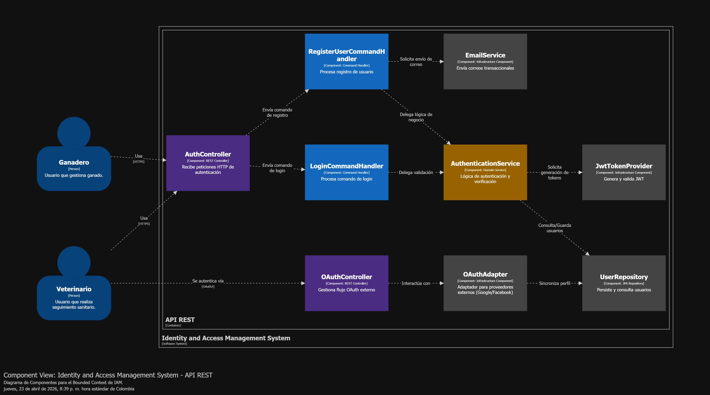

### 2.6.1.6. Bounded Context Software Architecture Code Level Diagrams
### 2.6.1.6.1. Bounded Context Domain Layer Class Diagrams

La siguiente imagen presenta el diagrama de clases modelado bajo los principios de Domain-Driven Design (DDD) para la seguridad del sistema. Se detallan el Aggregate Root (User), las Entidades secundarias (OAuthProvider), los Value Objects encargados de encapsular validaciones (Email, Password), y los contratos de las interfaces de repositorios.

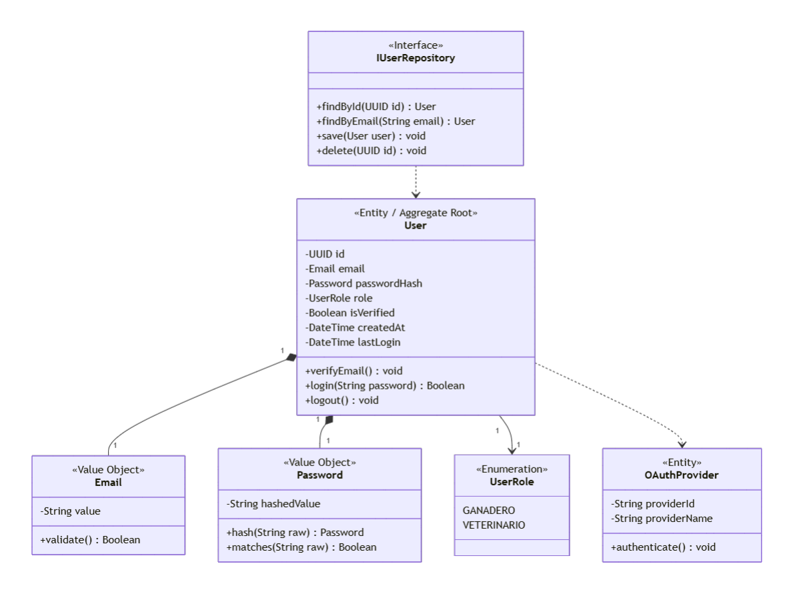

### 2.6.1.6.2. Bounded Context Database Design Diagram

El siguiente modelo físico de datos (ERD) define la estructura a nivel de base de datos relacional para el contexto de accesos. Representa el esquema de las tablas users y oauth_providers, especificando los tipos de datos, llaves primarias (UUIDs), llaves foráneas y las restricciones (constraints) necesarias para garantizar la integridad referencial.

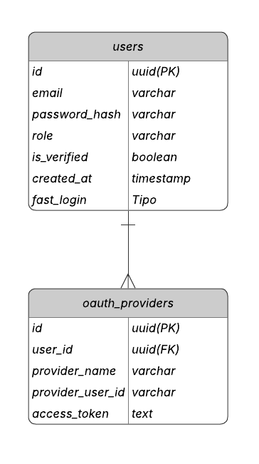

## 2.6.2. Bounded Context: Profile Management
### 2.6.2.1. Domain Layer

Gestiona la información del perfil de los usuarios (Ganadero y Veterinario), incluyendo foto, preferencias e idioma.

**Entities:**
  - **UserProfile:**
    - Propósito: Representa el perfil completo de un usuario en el sistema.
    - Atributos: id: UUID, userId: UUID, firstName: String, lastName: String, photoUrl: String, language: String, theme: ThemePreference (Enum), updatedAt: DateTime
    - Métodos: updatePhoto(url: String), updatePreferences(language, theme), modifyObject(data: ProfileData)

  - **VeterinarianProfile(extiende UserProfile):**
    - Atributos adicionales: licenseNumber: String, specialization: String, yearsOfExperience: Int
  
  - **FarmerProfile (extiende UserProfile)**
    - Atributos adicionales: farmName: String, farmLocation: String, livestockTypes: List<String>

**ValueObjects:**
  - **ProfileData:**
    - Propósito: Encapsula los datos modificables del perfil.
    - Atributos: firstName: String, lastName: String, language: String
    
  - **PhotoUrl:**
    - Propósito: Valida y encapsula la URL de la foto de perfil.
    - Atributos: value: String
    - Métodos: validate(): Boolean

**Enumeraciones:**
  - ThemePreference: LIGHT, DARK, SYSTEM

**DomainServices:**
  - **ProfileValidationService**
    - Propósito: Valida la coherencia de los datos del perfil antes de persistirlos.
    - Métodos: validateProfileData(data: ProfileData): Boolean

**Repository Intefaces:**
  - **IUserProfileRepository**
    - findByUserId(userId: UUID): UserProfile
    - save(profile: UserProfile): void
    - update(profile: UserProfile): void
  
### 2.6.2.2. Interface Layer

**ProfileController**
  - Propósito: Expone los endpoints REST para gestión del perfil.
  - Métodos:
    - GET /profile/{userId} → getProfile(userId: UUID)
    - PUT /profile/{userId} → updateProfile(UpdateProfileCommand)
    - POST /profile/{userId}/photo → uploadPhoto(file: MultipartFile)
    - PATCH /profile/{userId}/preferences → updatePreferences(PreferencesCommand)

### 2.6.2.3. Application Layer
  - **UpdateProfileCommandHandler**
    - Propósito: Maneja la actualización de datos del perfil.
    - Método: handle(UpdateProfileCommand): void
    - Lógica: Valida coherencia de datos y persiste cambios, dispara ProfileUpdated.

  - **UploadPhotoCommandHandler**
    - Propósito: Maneja la subida y cambio de foto de perfil.
    - Método: handle(UploadPhotoCommand): String
    - Lógica: Sube la imagen al storage y actualiza photoUrl.

  - **UpdatePreferencesCommandHandler**
    - Propósito: Maneja el cambio de idioma y tema.
    - Método: handle(UpdatePreferencesCommand): void

**Event Handlers:**
  - ProfileUpdatedEventHandler 
    - Propósito: Reacciona al evento ProfileUpdated para sincronizar datos con otros bounded contexts si es necesario.

### 2.6.2.4 Infrastructure Layer
**UserProfileRepository (implementa IUserProfileRepository)**
  - Tecnología: JPA/Hibernate.

**FileStorageService**
  - Propósito: Gestiona la subida y almacenamiento de fotos de perfil.
  - Tecnología: AWS S3 / Azure Blob Storage.
  - Métodos: upload(file): String, delete(url: String): void

### 2.6.2.5. Bounded Context Software Architecture Component Level Diagrams

El presente diagrama representa la estructura interna del contexto de gestión de perfiles. Se visualiza cómo los controladores delegan las operaciones de actualización de datos, configuración de preferencias y carga de fotografías hacia la capa de aplicación. Asimismo, se evidencia la conexión con la infraestructura para el almacenamiento físico en base de datos y la gestión de archivos en la nube

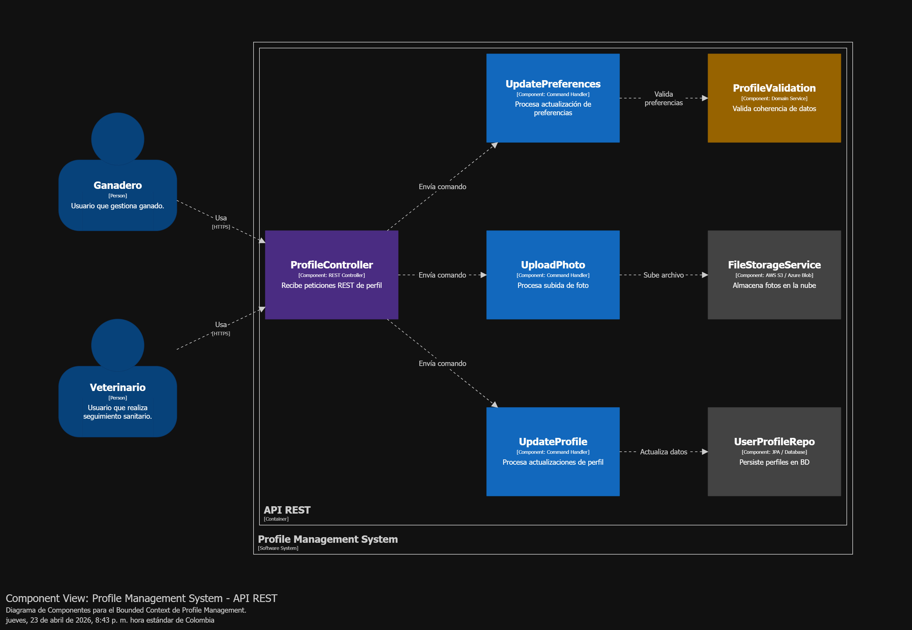

### 2.6.2.6. Bounded Context Software Architecture Code Level Diagrams
### 2.6.2.6.1. Bounded Context Domain Layer Class Diagrams

La figura a continuación modela la estructura orientada a objetos para los perfiles de los usuarios. Destaca la aplicación del polimorfismo mediante herencia, donde FarmerProfile y VeterinarianProfile extienden de la entidad base UserProfile, incorporando sus propios atributos específicos y delegando información a Value Objects asociados.
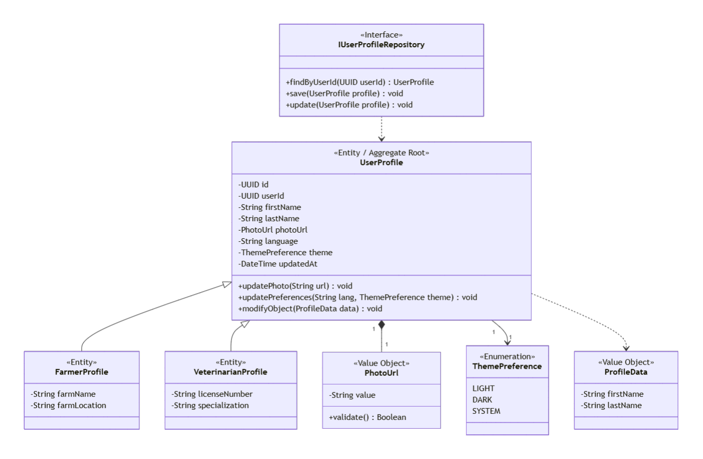

### 2.6.2.6.2. Bounded Context Database Design Diagram

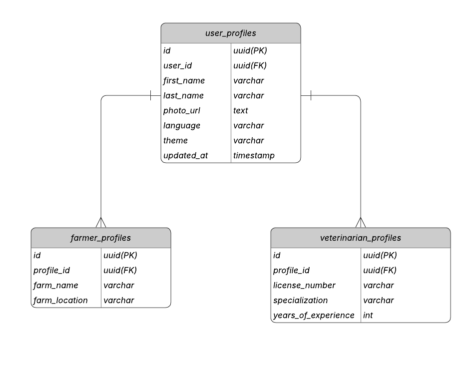

## 2.6.3. Bounded Context: Livestock Management
### 2.6.3.1. Domain Layer

Gestiona la creación de lotes de ganado, el registro individual de animales, su edición, traslado entre lotes y la asignación de planes alimentarios.

**Entities:**
  - **LivestockBatch (Lote de ganado)**
    - Propósito: Representa un grupo de animales manejados como unidad.
    - Atributos: id: UUID, name: String, farmerId: UUID, location: String, createdAt: DateTime
    - Métodos: edit(name, location), addAnimal(animal: Animal), removeAnimal(animalId: UUID)

  - **Animal**
    - Propósito: Representa un animal individual dentro de un lote.
    - Atributos: id: UUID, batchId: UUID, name: String, species: String, breed: String, birthDate: Date, gender: AnimalGender (Enum), weight: Double, status: AnimalStatus (Enum), registeredAt: DateTime
    - Métodos: edit(data: AnimalData), transferToBatch(newBatchId: UUID), updateWeight(weight: Double)

  - **FeedingPlan (Plan alimentario)**
    - Propósito: Representa el plan de alimentación asignado a un lote.
    - Atributos: id: UUID, batchId: UUID, dailyRation: Double, foodType: String, updatedAt: DateTime, updatedBy: UUID
    - Métodos: update(dailyRation, foodType), getRecommendedRation(): Double

**Value Objects:**

  - **AnimalData**
    - Propósito: Encapsula los datos modificables de un animal.
    - Atributos: name: String, breed: String, weight: Double

  - **Location**
    - Propósito: Representa la ubicación física de un lote.
    - Atributos: description: String

**Enumeraciones:**
  - AnimalGender: MALE, FEMALE
  - AnimalStatus: HEALTHY, SICK, QUARANTINE, DECEASED

**Domain Services:**
  - **LivestockTransferService**
    - Propósito: Orquesta el traslado de animales entre lotes validando las reglas de negocio.
    - Métodos: transfer(animalId: UUID, targetBatchId: UUID): void

  - **FeedingPlanService**
    - Propósito: Calcula y valida las raciones diarias recomendadas según especie y peso.
    - Métodos: calculateRecommendedRation(animal: Animal): Double

**Repository Interfaces:**
  - **ILivestockBatchRepository**
    - findById(id: UUID): LivestockBatch
    - findByFarmerId(farmerId: UUID): List<LivestockBatch>
    - save(batch: LivestockBatch): void
    - update(batch: LivestockBatch): void

  - **IAnimalRepository**
    - findById(id: UUID): Animal
    - findByBatchId(batchId: UUID): List<Animal>
    - save(animal: Animal): void
    - update(animal: Animal): void

  - **IFeedingPlanRepository**
    - findByBatchId(batchId: UUID): FeedingPlan
    - save(plan: FeedingPlan): void
    - update(plan: FeedingPlan): void

### 2.6.3.2. Interface Layer

  - **LivestockBatchController**
    - POST /batches → createBatch(CreateBatchCommand)
    - PUT /batches/{id} → editBatch(EditBatchCommand)
    - GET /batches/{farmerId} → getBatchesByFarmer(farmerId: UUID)

  - **AnimalController**
    - POST /batches/{batchId}/animals → registerAnimal(RegisterAnimalCommand)
    - PUT /animals/{id} → editAnimal(EditAnimalCommand)
    - PATCH /animals/{id}/transfer → transferAnimal(TransferAnimalCommand)
    - GET /animals/{id}/history → getAnimalHistory(id: UUID)

  - **FeedingPlanController**
    - POST /batches/{batchId}/feeding-plan → assignFeedingPlan(AssignFeedingPlanCommand)
    - PUT /batches/{batchId}/feeding-plan → updateFeedingPlan(UpdateFeedingPlanCommand)
    - GET /batches/{batchId}/feeding-plan → getDailyRation(batchId: UUID)

### 2.6.3.3. Application Layer

  - **CreateBatchCommandHandler**
    - Método: handle(CreateBatchCommand): void
    - Lógica: Crea el lote, valida datos y persiste. Dispara BatchCreated.

  - **EditBatchCommandHandler**
    - Método: handle(EditBatchCommand): void

  - **RegisterAnimalCommandHandler**
    - Método: handle(RegisterAnimalCommand): void
    - Lógica: Valida coherencia del animal, lo asocia al lote y persiste. Dispara AnimalRegistered.

  - **EditAnimalCommandHandler**
    - Método: handle(EditAnimalCommand): void

  - **TransferAnimalCommandHandler**
    - Método: handle(TransferAnimalCommand): void
    - Lógica: Invoca LivestockTransferService y dispara AnimalTransferred.

  - **AssignFeedingPlanCommandHandler**
    - Método: handle(AssignFeedingPlanCommand): void
    - Lógica: Crea o asigna plan alimentario al lote usando FeedingPlanService.

  - **UpdateFeedingPlanCommandHandler**
    - Método: handle(UpdateFeedingPlanCommand): void

**Event Handlers:**
  - AnimalRegisteredEventHandler: Registra el evento en el historial del animal.
  - AnimalTransferredEventHandler: Actualiza los registros de ambos lotes involucrados.

### 2.6.3.4 Infrastructure Layer

- **LivestockBatchRepository (implementa ILivestockBatchRepository)**

- **AnimalRepository (implementa IAnimalRepository)**

- **FeedingPlanRepository (implementa IFeedingPlanRepository)**
  - Tecnología: JPA/Hibernate con base de datos relacional.

- **AnimalHistoryLogger**
  - Propósito: Registra eventos del historial de cada animal (traslados, ediciones, cambios de estado).
  - Tecnología: Log en base de datos o sistema de eventos.

### 2.6.3.5. Bounded Context Software Architecture Component Level Diagrams

El siguiente diagrama expone los componentes del contexto core del sistema: la gestión ganadera. Muestra la orquestación técnica entre la creación de lotes, el registro y traslado de animales, y la asignación de planes alimentarios; evidenciando la interacción directa con los servicios de dominio y el registro histórico de eventos en la infraestructura.

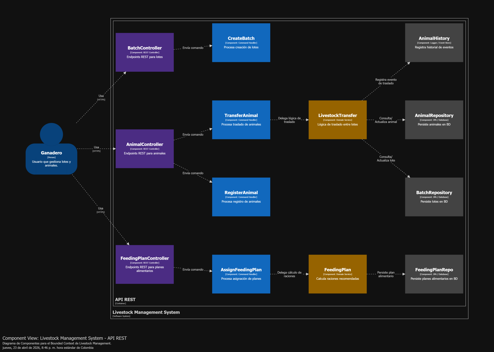

### 2.6.3.6. Bounded Context Software Architecture Code Level Diagrams
### 2.6.3.6.1. Bounded Context Domain Layer Class Diagrams

Este diagrama ilustra el modelo de clases que soporta la lógica central del negocio ganadero. Destaca el Aggregate Root LivestockBatch y su relación transaccional con entidades dependientes como Animal y FeedingPlan, mostrando claramente la cardinalidad, las enumeraciones de estados y las operaciones de dominio encapsuladas.

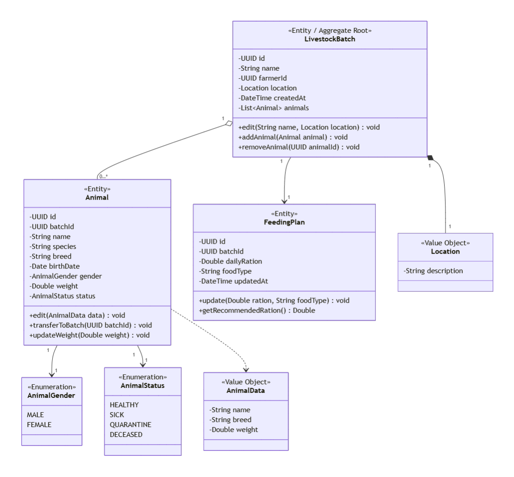

### 2.6.3.6.2. Bounded Context Database Design Diagram

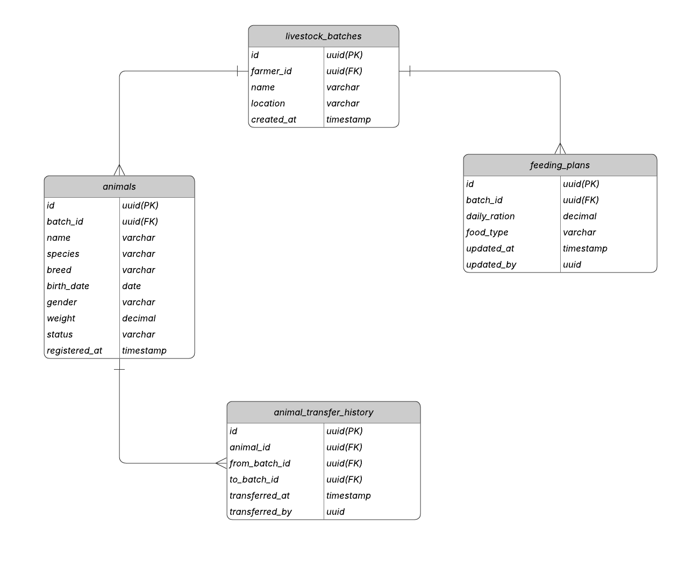

## 2.6.4. Bounded Context: Veterinary and Health
### 2.6.4.1. Domain Layer
Gestiona integralmente el ciclo de atención veterinaria del ganado, abarcando la programación de citas, ejecución de visitas técnicas, registro de diagnósticos y tratamientos, así como la emisión de certificados sanitarios y de trazabilidad.

**Entities:**
- **VeterinaryVisit (Visita técnica)**
  - Propósito: Representa una visita veterinaria programada o ejecutada para evaluar el estado de salud del ganado.
  - Atributos: id: UUID, farmerId: UUID, veterinarianId: UUID, scheduledDate: DateTime, startedAt: DateTime, finishedAt: DateTime, status: VisitStatus (Enum)
  - Métodos: schedule(date: DateTime), start(), finish(), cancel()

- **Diagnosis (Diagnóstico)**
  - Propósito: Representa el diagnóstico médico emitido durante una visita veterinaria.
  - Atributos: id: UUID, visitId: UUID, description: String, severity: DiagnosisSeverity (Enum), createdAt: DateTime, veterinarianId: UUID
  - Métodos: edit(description, severity)

- **Treatment (Tratamiento)**
  - Propósito: Representa un tratamiento aplicado como resultado de un diagnóstico.
  - Atributos: id: UUID, diagnosisId: UUID, treatmentType: String, dosage: String, durationDays: Int, appliedAt: DateTime
  - Métodos: apply()

- **HealthCertificate (Certificado sanitario)**
  - Propósito: Documento oficial que certifica el estado de salud y trazabilidad del ganado tras una visita técnica finalizada.
  - Atributos: id: UUID, visitId: UUID, certificateNumber: String, issuedAt: DateTime, status: CertificateStatus (Enum)
  - Métodos: generate(), invalidate()

**Value Objects:**
- **MedicalRecord**
  - Propósito: Encapsula el historial médico del ganado.
  - Atributos: diagnoses: List<Diagnosis>, treatments: List<Treatment>

- **VisitDate**
  - Propósito: Representa una fecha válida para una visita veterinaria.
  - Atributos: date: DateTime

**Enumeraciones:**
- VisitStatus: SCHEDULED, IN_PROGRESS, COMPLETED, CANCELED
- DiagnosisSeverity: LOW, MEDIUM, HIGH, CRITICAL
- CertificateStatus: ISSUED, INVALIDATED

**Domain Services:**
- **VisitSchedulingService**
  - Propósito: Valida la disponibilidad del veterinario y las fechas de atención.
  - Métodos: validateAvailability(veterinarianId: UUID, date: DateTime): Boolean

- **CertificationService**
  - Propósito: Orquesta la emisión de certificados sanitarios asegurando que la visita haya sido completada.
  - Métodos: issueCertificate(visit: VeterinaryVisit): HealthCertificate

**Repository Interfaces:**
- **IVeterinaryVisitRepository**
  - findById(id: UUID): VeterinaryVisit
  - findByFarmerId(farmerId: UUID): List<VeterinaryVisit>
  - save(visit: VeterinaryVisit): void
  - update(visit: VeterinaryVisit): void

- **IDiagnosisRepository**
  - findByVisitId(visitId: UUID): List<Diagnosis>
  - save(diagnosis: Diagnosis): void

- **IHealthCertificateRepository**
  - findByVisitId(visitId: UUID): HealthCertificate
  - save(certificate: HealthCertificate): void

### 2.6.4.2. Interface Layer
- **VeterinaryVisitController**
  - POST /visits → scheduleVisit(ScheduleVisitCommand)
  - PATCH /visits/{id}/start → startVisit(id: UUID)
  - PATCH /visits/{id}/finish → finishVisit(id: UUID)
  - DELETE /visits/{id} → cancelVisit(id: UUID)

- **DiagnosisController**
  - POST /visits/{visitId}/diagnosis → emitDiagnosis(EmitDiagnosisCommand)

- **CertificateController**
  - POST /visits/{visitId}/certificate → generateCertificate(GenerateCertificateCommand)

### 2.6.4.3. Application Layer

- **ScheduleVisitCommandHandler**
  - Método: handle(ScheduleVisitCommand): void
  - Lógica: Valida disponibilidad, agenda la visita y persiste la información. Dispara VisitScheduled.

- **StartVisitCommandHandler**
  - Método: handle(StartVisitCommand): void

- **FinishVisitCommandHandler**
  - Método: handle(FinishVisitCommand): void
  - Lógica: Marca la visita como completada y habilita la emisión de certificados.

- **EmitDiagnosisCommandHandler**
  - Método: handle(EmitDiagnosisCommand): void
  - Lógica: Registra el diagnóstico y actualiza el historial médico.

- **GenerateCertificateCommandHandler**
  - Método: handle(GenerateCertificateCommand): void
  - Lógica: Invoca CertificationService y genera el certificado sanitario.

**Event Handlers:**
- VisitCompletedEventHandler: Habilita la generación de certificados sanitarios.
- DiagnosisEmittedEventHandler: Actualiza el historial médico del ganado.

### 2.6.4.4. Infrastructure Layer
- **VeterinaryVisitRepository (implementa IVeterinaryVisitRepository)**
- **DiagnosisRepository (implementa IDiagnosisRepository)**
- **HealthCertificateRepository (implementa IHealthCertificateRepository)**
- Tecnología: JPA/Hibernate con base de datos relacional.

### 2.6.4.5. Bounded Context Software Architecture Component Level Diagrams
El siguiente diagrama expone los componentes del contexto de salud veterinaria, mostrando la interacción entre la programación de visitas, el registro de diagnósticos, la aplicación de tratamientos y la emisión de certificados sanitarios.

### 2.6.4.6. Bounded Context Software Architecture Code Level Diagrams
### 2.6.4.6.1. Bounded Context Domain Layer Class Diagrams
### 2.6.4.6.2. Bounded Context Database Design Diagram
Este diagrama ilustra el modelo de clases que soporta la lógica central del contexto veterinario.

### 2.6.4.6.2. Bounded Context Database Design Diagram

## 2.6.5. Bounded Context: Payments 
### 2.6.5.1. Domain Layer
Gestiona el procesamiento de pagos asociados a los servicios del sistema, incluyendo la generación de transacciones, validación de pagos, control de estados y emisión de comprobantes de pago.

**Entities:**
- **Payment**
  - Propósito: Representa un pago realizado por un usuario.
  - Atributos: id: UUID, farmerId: UUID, amount: Double, currency: String, status: PaymentStatus (Enum), createdAt: DateTime
  - Métodos: authorize(), complete(), fail()

- **Transaction**
  - Propósito: Representa una transacción financiera asociada a un pago.
  - Atributos: id: UUID, paymentId: UUID, provider: String, referenceCode: String, processedAt: DateTime
  - Métodos: register()

- **Invoice (Comprobante de pago)**
  - Propósito: Documento que certifica un pago exitoso.
  - Atributos: id: UUID, paymentId: UUID, invoiceNumber: String, issuedAt: DateTime
  - Métodos: generate()

**Value Objects:**
- **Money**
  - Propósito: Encapsula el valor monetario del pago.
  - Atributos: amount: Double, currency: String

**Enumeraciones:**
- PaymentStatus: PENDING, AUTHORIZED, COMPLETED, FAILED

**Domain Services:**
- **PaymentProcessingService**
  - Propósito: Orquesta la validación y ejecución del pago.
  - Métodos: process(payment: Payment): void

**Repository Interfaces:**
- **IPaymentRepository**
  - findById(id: UUID): Payment
  - findByFarmerId(farmerId: UUID): List<Payment>
  - save(payment: Payment): void
  - update(payment: Payment): void

- **IInvoiceRepository**
  - findByPaymentId(paymentId: UUID): Invoice
  - save(invoice: Invoice): void

---

### 2.6.5.2. Interface Layer
- **PaymentController**
  - POST /payments → createPayment(CreatePaymentCommand)
  - PATCH /payments/:id/process → processPayment(id: UUID)
  - GET /payments/:farmerId → getPaymentsByFarmer(farmerId: UUID)

- **InvoiceController**
  - GET /payments/:id/invoice → getInvoiceByPayment(id: UUID)

---

### 2.6.5.3. Application Layer
- **CreatePaymentCommandHandler**
  - Método: handle(CreatePaymentCommand): void
  - Lógica: Registra el pago y lo deja en estado PENDING.

- **ProcessPaymentCommandHandler**
  - Método: handle(ProcessPaymentCommand): void
  - Lógica: Invoca PaymentProcessingService y actualiza el estado del pago.

- **GenerateInvoiceCommandHandler**
  - Método: handle(GenerateInvoiceCommand): void
  - Lógica: Genera el comprobante si el pago fue exitoso.

**Event Handlers:**
- PaymentCompletedEventHandler: Dispara la generación del comprobante.
- PaymentFailedEventHandler: Registra el fallo del pago.

---

### 2.6.5.4. Infrastructure Layer
- **PaymentRepository (implementa IPaymentRepository)**
- **InvoiceRepository (implementa IInvoiceRepository)**
- **TransactionRepository**
- Tecnología: JPA/Hibernate con base de datos relacional.

---

### 2.6.5.5. Bounded Context Software Architecture Component Level Diagrams
El siguiente diagrama muestra el flujo de las APIs de pago, desde la creación del pago hasta la emisión del comprobante.

### 2.6.5.6. Bounded Context Software Architecture Code Level Diagrams
### 2.6.5.6.1. Bounded Context Domain Layer Class Diagrams

### 2.6.5.6.2. Bounded Context Database Design Diagram

## 2.6.6. Bounded Context: Notifications
### 2.6.6.1. Domain Layer

Gestiona la programación, envío y seguimiento de notificaciones push generadas por eventos del sistema, como citas programadas o cambios en su estado, manteniendo un historial consultable por el usuario.

**Entities:**

- **Notification**
  - Propósito: Representa una notificación enviada o programada para un usuario.
  - Atributos:  
    id: UUID  
    userId: UUID  
    title: String  
    message: String  
    status: NotificationStatus (Enum)  
    scheduledAt: DateTime  
    sentAt: DateTime  
    readAt: DateTime
  - Métodos:  
    markAsSent()  
    markAsRead()

- **NotificationSchedule**
  - Propósito: Representa la programación de una notificación futura.
  - Atributos:  
    id: UUID  
    notificationId: UUID  
    scheduledTime: DateTime
  - Métodos:  
    reschedule(newTime: DateTime)

**Value Objects:**

- **NotificationContent**
  - Propósito: Encapsula el contenido del mensaje.
  - Atributos: title: String, body: String

**Enumerations:**

- NotificationStatus: PENDING, SENT, READ, FAILED

**Domain Services:**

- **NotificationDispatchService**
  - Propósito: Orquesta el envío de notificaciones push.
  - Métodos: send(notification: Notification): void

**Repository Interfaces:**

- **INotificationRepository**
  - findById(id: UUID): Notification
  - findByUserId(userId: UUID): List<Notification>
  - save(notification: Notification): void
  - update(notification: Notification): void

---

### 2.6.6.2. Interface Layer

- **NotificationController**
  - POST /notifications/schedule → scheduleNotification(ScheduleNotificationCommand)
  - GET /notifications/{userId} → getUserNotifications(userId: UUID)
  - PATCH /notifications/{id}/read → markAsRead(id: UUID)

---

### 2.6.6.3. Application Layer

- **ScheduleNotificationCommandHandler**
  - Método: handle(ScheduleNotificationCommand): void
  - Lógica: Programa la notificación y la persiste.

- **SendNotificationCommandHandler**
  - Método: handle(SendNotificationCommand): void
  - Lógica: Invoca NotificationDispatchService y actualiza el estado.

- **MarkNotificationReadCommandHandler**
  - Método: handle(MarkNotificationReadCommand): void

**Event Handlers:**

- AppointmentScheduledEventHandler: Genera notificación por cita programada.
- AppointmentStatusChangedEventHandler: Notifica cambios en el estado de la cita.

---

### 2.6.6.4. Infrastructure Layer

- **NotificationRepository (implementa INotificationRepository)**
- **PushNotificationProvider**
  - Tecnología: Firebase Cloud Messaging / OneSignal
- **NotificationScheduler**
  - Tecnología: Jobs programados / cola de eventos

---

### 2.6.6.5. Bounded Context Software Architecture Component Level Diagram

### 2.6.6.6. Bounded Context Software Architecture Code Level Diagrams
### 2.6.6.6.1. Bounded Context Domain Layer Class Diagrams

### 2.6.6.6.2. Bounded Context Database Design Diagram

