

# Capítulo IV: Product Implementation & Validation

## 4. Product Implementation & Validation

##  4.1. Software Configuration Management
### 4.1.1. Software Development Environment Configuration

#### Gestión del Proyecto

Para la coordinación del proyecto se emplearon diversas plataformas de comunicación y gestión de versiones. Se estableció una organización en GitHub para concentrar el manejo del código fuente y su control de versiones. Respecto a la comunicación interna y reuniones del equipo, se empleó Discord como plataforma principal.

- **Coordinación del trabajo:** Github
- **Reuniones virtuales:** Discord
- **Comunicación diaria:** Whatsapp
- **Organización y seguimiento de tareas:** Trello

**Enlaces de referencia:**
- Github: https://github.com/
- Discord: https://discord.com/
- Trello: https://trello.com/

#### Gestión de Requerimientos

Durante esta etapa, se adoptaron estrategias específicas que permitieron la captura, estructuración y jerarquización de los requerimientos del proyecto. Se empleó Trello como plataforma visual para administrar actividades a través de tableros configurables. Se recurrió a UXPressia para elaborar user personas, mapas de empatía, journey maps y el lean UX canvas. Se utilizó Miro para construir los escenarios As-Is y To-Be.

**Enlaces de referencia:**
- Trello: https://trello.com/
- UXPressia: https://uxpressia.com/
- Miro: https://miro.com/es/

#### Diseño de Experiencia e Interfaz del Producto

En la fase de diseño de la experiencia e interfaz de usuario, el equipo empleó Figma para elaborar wireframes, maquetas y prototipos interactivos, lo cual facilitó la validación de la propuesta de diseño previo a su desarrollo.

**Enlaces de referencia:**
- Figma: https://www.figma.com/

#### Desarrollo de Software

Para la construcción de la aplicación móvil se utilizaron tecnologías como Kotlin para Android en Android Studio. La documentación del informe se desarrolló en archivos .md empleando IDEs como IntelliJ IDEA y Rider (cada integrante del equipo trabajó con alguna de estas herramientas). Para facilitar la descarga, instalación y actualización de estos IDEs se utilizó la herramienta de gestión JetBrains ToolBox.

**Enlaces de referencia:**
- JetBrains ToolBox: https://www.jetbrains.com/toolbox-app/
- Android Studio: https://developer.android.com/studio

#### Documentación de Software

Para el manejo de versiones y la colaboración en el desarrollo del informe, se empleó GitHub implementando la metodología GitHub Flow. Esta estrategia facilitó una administración organizada y eficaz del proyecto a través del uso de ramas específicas para cada característica o corrección, lo que optimizó el trabajo en equipo. Todo el material del proyecto fue consolidado y guardado en un repositorio dentro de una organización establecida en GitHub. Para la documentación técnica del proyecto se seleccionó el uso de archivos en formato Markdown, por su sencillez, claridad y perfecta integración con GitHub.

**Enlaces de referencia:**
- GitHub: https://github.com/

#### Despliegue de Software

Para la distribución de la aplicación móvil se utilizarán plataformas como Google Play Store para Android, las cuales son ideales para la publicación y distribución de aplicaciones móviles.

**Enlaces de referencia:**
- Google Play Console: https://play.google.com/console/

### 4.1.2. Source Code Management

#### Estructura de ramas Git Flow

- **main:** rama primaria donde siempre se mantiene el código estable y preparado para producción.
- **develop:** rama de desarrollo donde se consolidan todas las nuevas características antes de ser transferidas a producción.
- **feature/:** ramas destinadas a desarrollar nuevas funcionalidades.
- **release/:** ramas temporales para preparar una nueva versión estable.
- **hotfix/:** ramas para solucionar errores críticos en producción.

#### Versionado Semántico (Semantic Versioning)

Se implementará el sistema de versionado semántico (Semantic Versioning 2.0.0), aplicando el formato: **MAJOR.MINOR.PATCH**.

- 1.0.0 → versión estable inicial
- 1.1.0 → inclusión de nuevas características
- 1.1.1 → corrección de errores

#### Estándar de mensajes de commits

El equipo adoptará el estándar de mensajes de commits establecido en "Conventional Commits".

**Ejemplos de mensajes:**

- `feat: implementar nuevo sistema de autenticación`
- `fix: resolver validación en formulario de registro`
- `docs: actualizar README con guías de implementación`

#### Nomenclatura para numeración de versiones:

- **Cambios Mayores:** Cuando el código o versión nueva del proyecto implementado presenta modificaciones sustanciales respecto a la versión anterior, estos cambios resultan incompatibles con la versión previa.
- **Cambios Menores:** Cuando el código o versión nueva del proyecto implementado presenta modificaciones respecto a alguna característica específica.
- **Patch:** Cuando se resuelven errores menores.

#### Repositorio de Github:

- Enlace para acceder al repositorio de la landing page: 
- Enlace para acceder al repositorio de la aplicación móvil: 
- Enlace para acceder al repositorio del Informe: 

#### Metodología de trabajo GitFlow
La metodología de trabajo se fundamentará en un modelo de ramas Git Flow, el cual se basa en la generación de ramas específicas para cada funcionalidad o corrección de errores. El modelo de "A successful Git branching model"

#### Organización de branches (Ramas):

1. **Master branch (Rama primaria):** Es la rama fundamental del proyecto, donde se conserva el código estable y preparado para producción. Únicamente se incorporarán modificaciones que hayan sido probadas y validadas previamente en las ramas de desarrollo y funcionalidad.

2. **Develop Branch (Rama de Desarrollo):** Esta rama funciona como un espacio de consolidación para el trabajo colaborativo, facilitando pruebas y ajustes de las nuevas funcionalidades antes de fusionarlas con la rama primaria. Asegura que el código sea operativo y estable.

3. **Feature branch (Ramas de funcionalidad):** Cada nueva característica o tarea específica se construirá en su propia rama. Una vez finalizada y probada, se consolidará en la rama de desarrollo. Las ramas de funcionalidad seguirán un esquema de nombres descriptivos, como por ejemplo: `feature/user-authentication`.

### 4.1.3. Source Code Style Guide & Conventions

El equipo establecerá nomenclatura en inglés para todas las variables, funciones, clases y archivos del proyecto, con el propósito de preservar flexibilidad, escalabilidad y consistencia en el desarrollo.

#### Desarrollo Android (Kotlin)
Se implementa el estilo de código oficial de Android y las convenciones de Kotlin.

- Los nombres de clases seguirán PascalCase (`MainActivity`, `UserRepository`).
- Las funciones y variables utilizarán camelCase (`getCurrentUser`, `isLoggedIn`).
- Los recursos seguirán snake_case (`activity_main`, `btn_login`).
- Identificadores descriptivos y claros para accesibilidad y mantenimiento.

Se emplearon diferentes componentes para estructurar la aplicación móvil:

- **Activity:** Define las pantallas principales de la aplicación móvil.
- **Fragment:** Establece las secciones modulares que conforman las diferentes vistas de la aplicación.
- **View:** Permite la organización de diferentes elementos visuales dentro de la aplicación, facilitando la aplicación de estilos específicos para cada componente.
- **ImageView:** Facilita la integración de imágenes en la aplicación móvil, utilizado frecuentemente a lo largo de la aplicación.
- **RecyclerView:** Sirve para mostrar listas dinámicas de elementos, principalmente empleado para la visualización de datos y menús interactivos.
- **Button:** Establece botones interactivos personalizables que permiten a los usuarios ejecutar acciones específicas.
- **TextView:** Define los textos y etiquetas, diferenciándolos del resto del contenido visual.

### 4.1.4. Software Deployment Configuration

#### Despliegue de aplicación móvil:

Para publicar la aplicación móvil, es fundamental cumplir con ciertos requisitos previos, como disponer de una cuenta de desarrollador, configurar el proyecto y preparar los archivos de distribución. Una vez satisfechos estos requisitos, se pueden ejecutar los pasos detallados a continuación para realizar la publicación:

1. Verificar que el proyecto esté configurado correctamente con las dependencias necesarias.
2. Asegurarse de que la aplicación cumpla con las convenciones de nomenclatura: archivos de configuración como "build.gradle", "AndroidManifest.xml", estructura de carpetas "res/" para recursos, y "src/" para código fuente.
3. Generar el archivo APK o AAB (Android App Bundle) para distribución.
4. Acceder a Google Play Console y crear una nueva aplicación o versión.
5. Configurar la información de la aplicación, capturas de pantalla y descripción.
6. Subir el archivo de la aplicación y esperar la revisión de Google Play Store.

#### Google Play Store:

El enlace de la aplicación en Google Play Store será proporcionado una vez completado el proceso de publicación y aprobación.

## 4.2. Landing Page & Mobile Application Implementation
### 4.2.1. Sprint 1
### 4.2.1.1. Sprint Planning 1

<table border="1" cellpadding="6" cellspacing="0" style="border-collapse:collapse; width:100%;">
  <tr>
    <td><strong>Sprint #</strong></td>
    <td>Sprint 1</td>
  </tr>
  <tr>
    <td colspan="2"><strong>Sprint Planning Background</strong></td>
  </tr>
  <tr>
    <td><strong>Date</strong></td>
    <td>2026-05-05</td>
  </tr>
  <tr>
    <td><strong>Time</strong></td>
    <td>07:00 PM</td>
  </tr>
  <tr>
    <td><strong>Location</strong></td>
    <td>Reunión virtual mediante Discord</td>
  </tr>
  <tr>
    <td><strong>Prepared By</strong></td>
    <td>Inga Hernández, Ayrton Damian</td>
  </tr>
  <tr>
    <td><strong>Attendees (to planning meeting)</strong></td>
    <td>Flores Manrique, Sebastian Enrique / De las Casas Latour, Sebastián / Esquirva León, Miguel Juan Diego / Inga Hernández, Ayrton Damian / Meza Tataje, David</td>
  </tr>
  <tr>
    <td><strong>Sprint 0 Review Summary</strong></td>
    <td>No aplica. Corresponde al primer Sprint del proyecto, por lo que no existe un sprint anterior del cual reportar resultados.</td>
  </tr>
  <tr>
    <td><strong>Sprint 0 Retrospective Summary</strong></td>
    <td>No aplica. Al ser el Sprint inicial, el equipo realizó una reunión de kickoff donde se definieron los acuerdos de trabajo, herramientas de comunicación, convenciones de código y la distribución inicial de responsabilidades entre los integrantes.</td>
  </tr>
  <tr>
    <td colspan="2"><strong>Sprint Goal &amp; User Stories</strong></td>
  </tr>
  <tr>
    <td><strong>Sprint 1 Goal</strong></td>
    <td>Implementar la landing page completa y responsiva de Bovix, el flujo de registro e inicio de sesión de usuarios con autenticación JWT, y el módulo de registro de vacunas en la aplicación móvil Android.</td>
  </tr>
  <tr>
    <td><strong>Sprint 1 Velocity</strong></td>
    <td>32 Story Points</td>
  </tr>
  <tr>
    <td><strong>Sum of Story Points</strong></td>
    <td>32</td>
  </tr>
</table>

### 4.2.1.2. Sprint Backlog 1

En esta primera iteración, el objetivo planteado fue implementar la landing page de
Bovix para dar a conocer las funciones y servicios de la plataforma, junto con las
funcionalidades base de autenticación y registro sanitario del ganado. Las secciones
deben estar correctamente implementadas al finalizar el Sprint: landing page, registro
de usuario, inicio de sesión y registro de vacunas.

| id | Title | Id | Title | Description | Estimations (Hours) | Status (To-do / In-Process / To-Review / Done) |
|---|---|---|---|---|---|---|
| US04 | Explorar landing page | CC01 | Header y navbar responsivos | Desarrollo e implementación de la estructura del encabezado y barra de navegación. Debe ser responsive. | 2 | Done |
| US04 | Explorar landing page | CC02 | Sección Hero | Desarrollo e implementación de los estilos correspondientes a la sección Hero. Debe ser responsive. | 2 | Done |
| US04 | Explorar landing page | CC03 | Sección About Us | Desarrollo e implementación de la sección que describe el equipo y la misión de Bovix. Debe ser responsive. | 2 | Done |
| US04 | Explorar landing page | CC04 | Sección Product | Desarrollo e implementación de la sección que describe las funcionalidades y segmentos del producto. | 2 | Done |
| US04 | Explorar landing page | CC05 | Sección Contact y Footer | Desarrollo e implementación de la sección de contacto y pie de página con enlaces a redes sociales. | 2 | Done |
| US01 | Registro de usuario | CC06 | Formulario de registro | Desarrollo del formulario de registro con validaciones de campos obligatorios y mensajes de error. | 3 | Done |
| US01 | Registro de usuario | CC07 | Lógica de creación de cuenta | Implementación de la lógica de creación de cuenta, hash de contraseña y persistencia en base de datos. | 4 | Done |
| US02 | Inicio de sesión | CC08 | Formulario de login | Desarrollo del formulario de inicio de sesión con validación de campos y credenciales. | 3 | Done |
| US02 | Inicio de sesión | CC09 | Lógica de autenticación | Implementación de la autenticación con JWT y redirección al dashboard tras login exitoso. | 4 | Done |
| US03 | Registrar vacuna | CC10 | Formulario de registro de vacuna | Desarrollo del formulario con campos: tipo de vacuna, fecha de aplicación, dosis y animal asociado. | 3 | Done |
| US03 | Registrar vacuna | CC11 | Lógica de guardado de vacuna | Implementación del guardado del registro de vacuna con control de errores y confirmación de éxito. | 5 | Done |

---

### 4.2.1.3. Development Evidence for Sprint Review

Durante el Sprint 1 se implementaron las funcionalidades base de la plataforma Bovix.
Se desarrolló la landing page, el flujo de registro de usuarios, el inicio de sesión
y el registro de vacunas del ganado.

**Software Development:**

- **GitHub:** Plataforma de desarrollo colaborativo que utiliza el sistema de control
  de versiones Git. Se utiliza para alojar, revisar y colaborar en los repositorios
  del proyecto, facilitando el trabajo en equipo.

- **Android Studio:** Entorno de desarrollo integrado (IDE) creado por Google para
  el desarrollo de aplicaciones Android. Permite escribir, depurar y empaquetar la
  aplicación móvil de Bovix.

- **Visual Studio Code:** Editor de código utilizado para el desarrollo de la
  landing page y servicios complementarios del proyecto.

**Source Code Management:**

Utilizamos GitHub para llevar el control de versiones y trabajar de forma colaborativa.
Hemos creado una organización con los repositorios correspondientes:

- Repositorio de la Landing Page: *(Insertar enlace)*
- Repositorio de la aplicación móvil: *(Insertar enlace)*
- Repositorio del backend: *(Insertar enlace)*

**Mobile Application — Kotlin:**

Para el desarrollo móvil nos guiamos por la "Guía de Estilo de Kotlin" de Android Developers:

- **Nombres de clases:** Se escriben en formato PascalCase y son sustantivos o frases nominales.
- **Nombres de funciones:** Se escriben en camelCase y suelen ser verbos o frases verbales.
- **Sangría:** Cada bloque nuevo aumenta la sangría en 4 espacios.
- **Constantes:** Se escriben en UPPER_SNAKE_CASE con palabras separadas por guiones bajos.
- **No constantes:** Se escriben en camelCase para propiedades de instancia y parámetros.

**Landing Page — HTML/CSS:**

- Siempre declarar el tipo de documento (`<!DOCTYPE html>`) en la primera línea.
- Usar minúsculas para los nombres de etiquetas y atributos.
- Cerrar todas las etiquetas correctamente.
- Usar comillas dobles para los valores de los atributos.
- Especificar los atributos `alt`, `width` y `height` en todas las imágenes.

---

### 4.2.1.4. Testing Suite Evidence for Sprint Review

Para el Sprint 1 se elaboraron pruebas de aceptación basadas en los criterios
Gherkin definidos en las User Stories priorizadas. Se verificaron todos los
escenarios (E01, E02, E03) de cada historia de usuario.

**Lenguaje Gherkin:**

El lenguaje Gherkin es un lenguaje de dominio específico utilizado para escribir
pruebas de aceptación en formato legible por el equipo. Se utilizaron las siguientes
palabras clave: `Feature`, `Scenario`, `Given`, `When`, `Then` y `And`.

| User Story | Escenario | Criterio verificado | Estado |
|---|---|---|---|
| US04 – Explorar landing page | E01 | La landing page carga correctamente en Chrome y Firefox | Done |
| US04 – Explorar landing page | E02 | La navegación entre secciones funciona con scroll suave | Done |
| US01 – Registro de usuario | E01 | El sistema crea la cuenta con datos válidos y muestra confirmación | Done |
| US01 – Registro de usuario | E02 | El sistema solicita completar los campos obligatorios vacíos | Done |
| US01 – Registro de usuario | E03 | El sistema muestra mensaje de error con datos de formato inválido | Done |
| US02 – Inicio de sesión | E01 | El sistema permite el acceso con credenciales válidas | Done |
| US02 – Inicio de sesión | E02 | El sistema rechaza el acceso con credenciales incorrectas | Done |
| US02 – Inicio de sesión | E03 | El sistema solicita completar los campos vacíos antes de procesar | Done |
| US03 – Registrar vacuna | E01 | El sistema guarda correctamente el registro de vacuna | Done |
| US03 – Registrar vacuna | E02 | El sistema muestra error al ingresar datos incorrectos en el formulario | Done |

---

### 4.2.1.5. Execution Evidence for Sprint Review

Durante el Sprint 1 se implementaron y ejecutaron satisfactoriamente las siguientes
funcionalidades:

**Landing Page de Bovix**

Se desarrolló la landing page completa con las secciones: Home, About Us, Product,
About the Team y Contact. La página es completamente responsive y permite la
navegación fluida entre secciones mediante scroll suave, facilitando que cualquier
visitante conozca el producto antes de registrarse.

Se implementó el formulario de registro con validaciones en tiempo real.
El sistema detecta campos vacíos y formatos inválidos mostrando mensajes de error
descriptivos. Ante un registro exitoso el usuario recibe confirmación y es redirigido
al formulario de inicio de sesión.

**Inicio de sesión (US02)**

Se implementó el flujo completo de autenticación. Las credenciales inválidas generan
un mensaje de error sin permitir el acceso al sistema. Ante un login exitoso el
usuario es redirigido al dashboard principal.

**Registro de vacuna (US03)**

Se implementó el formulario para registrar vacunas del ganado. El ganadero puede
ingresar el tipo de vacuna, fecha de aplicación, dosis y animal asociado. El sistema
valida los datos y confirma el guardado con un mensaje de éxito.

---

### 4.2.1.6. Services Documentation Evidence for Sprint Review

Durante el Sprint 1 se documentaron de forma preliminar los servicios de backend
según la arquitectura definida en el Capítulo II. La documentación completa en
Swagger se publicará en el Sprint 2 una vez los endpoints estén desplegados.

**Plataforma de despliegue planificada:** Render (Web Service con Docker) + Aiven (Base de datos MySQL 8.4.8)

<td>
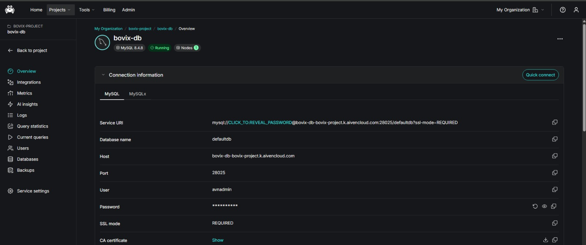
</td>

<td>
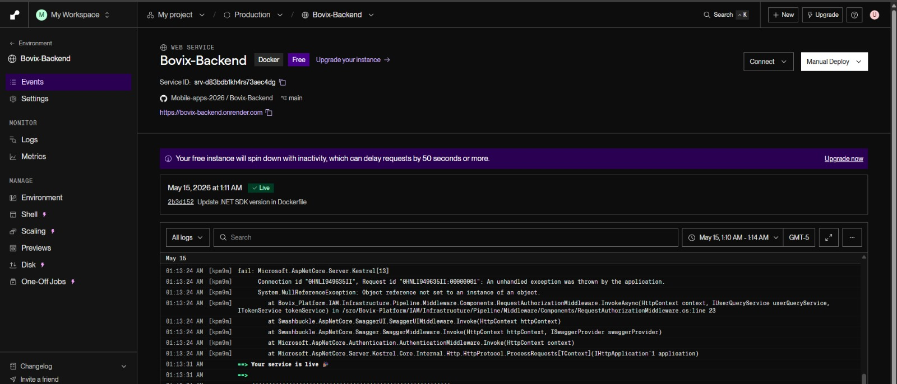
</td>

**Tabla de Endpoints de la API de Bovix:** 

> **Enlace a documentación Swagger:** [BackEnd](https://bovix-backend.onrender.com/swagger/index.html)

---

### 4.2.1.7. Software Deployment Evidence for Sprint Review

Durante el Sprint 1 se realizó el despliegue de la landing page de Bovix como
primer entregable público de la plataforma.

**Plataforma utilizada:** Github Pages

<td>
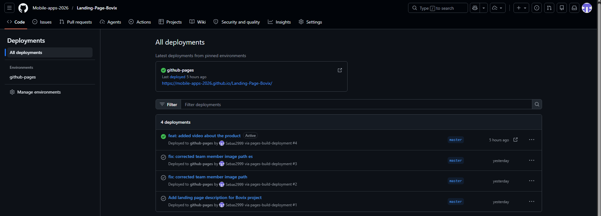
</td>

**Pasos realizados para el despliegue:** 
Se desarrolló la landing page en el repositorio del equipo bajo la organización Mobile-apps-2026.
Se configuró GitHub Pages desde la sección Settings > Pages del repositorio, seleccionando la rama main como fuente de publicación.
GitHub Pages generó automáticamente la URL pública del sitio una vez activado el despliegue.
Se verificó el correcto funcionamiento de la página accediendo a la URL generada.

**URL de la Landing Page:** [Landing page](https://mobile-apps-2026.github.io/Landing-Page-Bovix/)

---

### 4.2.1.8. Team Collaboration Insights during Sprint

Durante el Sprint 1 el equipo mantuvo comunicación activa y colaboración organizada
mediante las siguientes herramientas:

**Project Management:**

- **Discord:** Canal principal de comunicación para reuniones de planificación,
  daily check-ins y resolución de dudas técnicas en tiempo real.
- **Google Meet:** Plataforma de videoconferencias utilizada para reuniones de
  revisión y retrospectiva del sprint.

**Source Code Management:**

Utilizamos GitHub para el control de versiones y el trabajo colaborativo.
Se siguió el modelo GitFlow con ramas `feature/` para cada funcionalidad y
se aplicó la convención de Conventional Commits en los mensajes
(`feat:`, `fix:`, `docs:`, `style:`, `refactor:`).

**Distribución del trabajo por integrante:**

| Integrante | Tareas principales en Sprint 1 |
|---|---|
| Flores Manrique, Sebastian Enrique | Lógica de creación de cuenta y guardado de vacunas |
| De las Casas Latour, Sebastián | Secciones de landing page y formulario de login |
| Esquirva León, Miguel Juan Diego | Estructura HTML de landing page y validaciones de vacuna |
| Inga Hernández, Ayrton Damian | Formulario de registro de usuario y lógica de autenticación |
| Meza Tataje, David | Estilos responsive de landing page y formulario de vacuna |

### 4.2.2. Sprint 2
### 4.2.2.1. Sprint Planning 2

<table border="1" cellpadding="6" cellspacing="0" style="border-collapse:collapse; width:100%;">
  <tr>
    <td><strong>Sprint #</strong></td>
    <td>Sprint 2</td>
  </tr>
  <tr>
    <td colspan="2"><strong>Sprint Planning Background</strong></td>
  </tr>
  <tr>
    <td><strong>Date</strong></td>
    <td>2026-06-01</td>
  </tr>
  <tr>
    <td><strong>Time</strong></td>
    <td>07:00 PM</td>
  </tr>
  <tr>
    <td><strong>Location</strong></td>
    <td>Reunión virtual mediante Discord</td>
  </tr>
  <tr>
    <td><strong>Prepared By</strong></td>
    <td>Inga Hernández, Ayrton Damian</td>
  </tr>
  <tr>
    <td><strong>Attendees (to planning meeting)</strong></td>
    <td>Flores Manrique, Sebastian Enrique / De las Casas Latour, Sebastián / Esquirva León, Miguel Juan Diego / Inga Hernández, Ayrton Damian / Meza Tataje, David</td>
  </tr>
  <tr>
    <td><strong>Sprint 1 Review Summary</strong></td>
    <td>Durante el Sprint 1 se implementó satisfactoriamente la landing page completa de Bovix, el flujo de registro de usuarios, el inicio de sesión con autenticación JWT y el módulo de registro de vacunas en la aplicación móvil Android. Todas las funcionalidades planificadas fueron entregadas y verificadas correctamente.</td>
  </tr>
  <tr>
    <td><strong>Sprint 1 Retrospective Summary</strong></td>
    <td>El equipo destacó la buena coordinación mediante Discord y la distribución clara de tareas entre los integrantes. Se identificó la necesidad de mejorar la velocidad de integración entre frontend y backend, y de documentar los endpoints desde el inicio del desarrollo para facilitar su consumo desde la aplicación móvil.</td>
  </tr>
  <tr>
    <td colspan="2"><strong>Sprint Goal &amp; User Stories</strong></td>
  </tr>
  <tr>
    <td><strong>Sprint 2 Goal</strong></td>
    <td>Implementar e integrar el frontend Android con el backend .NET, desarrollar los módulos esenciales de gestión ganadera (bovinos, establos, alimentación y salud), desplegar el sistema completo con aislamiento de datos por usuario autenticado, e iniciar las vistas Flutter para el segmento veterinario.</td>
  </tr>
  <tr>
    <td><strong>Sprint 2 Velocity</strong></td>
    <td>68 Story Points</td>
  </tr>
  <tr>
    <td><strong>Sum of Story Points</strong></td>
    <td>68</td>
  </tr>
</table>

### 4.2.2.2. Sprint Backlog 2

En esta segunda iteración, el objetivo planteado fue implementar e integrar tanto la parte del frontend y el backend con las funcionalidades describidas en este trabajo. Las secciones
deben estar correctamente implementadas al finalizar el Sprint: backend, frontend, inicio de sesión, registro de vacunas, cruds esenciales, integracion con base de datos y features explicados.

| id | Title | Id | Title | Description | Estimations (Hours) | Status (To-do / In-Process / To-Review / Done) |
|---|---|---|---|---|---|---|
| US005 | Inicio de Sesión | CC12 | Pantalla de inicio de sesión (mobile) | Implementación de la pantalla de login en Android con validación de campos y manejo de errores de credenciales. | 3 | Done |
| US006 | Cerrar Sesión | CC13 | Lógica de cierre de sesión | Implementación del flujo de logout que elimina el token local y redirige al login. | 2 | Done |
| TS008 | Implementación de Autenticación JWT | CC14 | Middleware JWT en backend | Implementación del middleware de autenticación JWT que protege los endpoints y extrae el usuario autenticado del token. | 4 | Done |
| US007 | Registro de Ganado | CC15 | Formulario de registro de bovino | Desarrollo del formulario de creación de animal con campos: nombre, género, raza, peso, estado y establo asignado. | 3 | Done |
| US008 | Consulta de Información del Ganado | CC16 | Vista de listado de ganado | Implementación de la pantalla de lista de bovinos con datos sincronizados desde el backend. | 3 | Done |
| US009 | Actualización de Información del Ganado | CC17 | Formulario de edición de bovino | Desarrollo del formulario de edición con precarga de datos existentes y guardado de cambios en el backend. | 3 | Done |
| US010 | Gestión de Lotes de Ganado | CC18 | Vista CRUD de establos | Implementación de la pantalla de establos para organizar el ganado por lotes o corrales con operaciones de creación y eliminación. | 4 | Done |
| TS009 | Endpoints REST para Gestión de Ganado | CC19 | Endpoints REST de bovinos (backend) | Implementación de los endpoints POST, GET, PUT y DELETE para la gestión de bovinos con filtrado por usuario autenticado. | 5 | Done |
| TS010 | Gestión de Lotes y Relaciones entre Animales | CC20 | Endpoints REST de establos (backend) | Implementación de los endpoints POST, GET y DELETE para la gestión de establos con filtrado por usuario. | 3 | Done |
| US011 | Registro de Alimentación | CC21 | Vista y formulario de planes de alimentación | Desarrollo de la pantalla de planes de alimentación con registro de componentes, porcentajes y raciones diarias. | 4 | Done |
| TS011 | Endpoints para Gestión Sanitaria y Vacunas | CC22 | Endpoints REST de salud y alimentación (backend) | Implementación de endpoints para gestión de planes de alimentación y citas veterinarias con filtrado por userId. | 5 | Done |
| US012 | Monitoreo y Consulta de Historial Sanitario | CC23 | Vista de citas veterinarias | Implementación de la pantalla de citas con listado, próxima cita y detalle de estado por registro. | 3 | Done |
| US013 | Registro de Vacunas y Controles Preventivos | CC24 | Formulario de registro de cita veterinaria | Desarrollo del formulario de creación de cita con campos: animal, tipo, motivo, fecha programada y estado. | 3 | Done |
| US015 | Visualización de Reportes Productivos | CC25 | Dashboard con estadísticas de ganado | Desarrollo del panel principal con estadísticas reactivas: total de animales, lotes activos, citas hoy y alertas. | 4 | Done |
| US016 | Consulta de Historial Sanitario | CC26 | Sección de actividad reciente | Implementación del módulo de actividad reciente en el Home, mostrando los últimos bovinos y planes de alimentación registrados. | 3 | Done |
| US017 | Visualización de Alertas y Estadísticas Sanitarias | CC27 | Indicadores reactivos en el dashboard | Implementación de contadores reactivos de alertas y citas del día en el dashboard usando Kotlin Flow y Room. | 2 | Done |
| TS012 | Implementación de Generación de Reportes y Estadísticas | CC28 | Endpoint HomeSummary (backend) | Implementación del endpoint que consolida estadísticas totales de ganado, citas y alertas filtradas por usuario autenticado. | 3 | Done |
| TS009 | Integración frontend-backend | CC29 | Configuración Retrofit e interceptores JWT | Configuración del cliente HTTP Retrofit con interceptor de token JWT y sincronización de datos remotos con base de datos local Room. | 5 | Done |
| US018 | Registro de Visita Técnica y Diagnósticos en Campo | CC30 | Vistas Flutter del módulo veterinario | Desarrollo de las vistas de la aplicación Flutter correspondientes al segmento de profesional de la salud veterinaria: pantallas de registro de visita, diagnóstico y control sanitario. Solo implementación visual (sin integración backend). | 5 | In-Process |

---

### 4.2.2.3. Development Evidence for Sprint Review

Durante el Sprint 2 se completaron las funcionalidades faltantes de la plataforma Bovix.
Se desarrolló lel frontend kotlin, el backend, la integracion y vistas de frontend flutter.

**Software Development:**

- **GitHub:** Plataforma de desarrollo colaborativo que utiliza el sistema de control
  de versiones Git. Se utiliza para alojar, revisar y colaborar en los repositorios
  del proyecto, facilitando el trabajo en equipo.

- **Android Studio:** Entorno de desarrollo integrado (IDE) creado por Google para
  el desarrollo de aplicaciones Android. Permite escribir, depurar y empaquetar la
  aplicación móvil de Bovix.

- **Visual Studio Code:** Editor de código utilizado para el desarrollo de las
  vistas en flutter y servicios complementarios del proyecto.

**Source Code Management:**

Utilizamos GitHub para llevar el control de versiones y trabajar de forma colaborativa.
Hemos creado una organización con los repositorios correspondientes:

- Repositorio de la Landing Page: https://github.com/Mobile-apps-2026/Landing-Page-Bovix
- Repositorio de la aplicación móvil (kotlin): https://github.com/Mobile-apps-2026/Bovix-Android
- Repositorio del backend: https://github.com/Mobile-apps-2026/Bovix-Backend
- Repositorio de la aplicacion movil (flutter): https://github.com/Mobile-apps-2026/Bovix-Flutter

**Mobile Application — Kotlin:**

Para el desarrollo móvil nos guiamos por la "Guía de Estilo de Kotlin" de Android Developers:

- **Nombres de clases:** Se escriben en formato PascalCase y son sustantivos o frases nominales.
- **Nombres de funciones:** Se escriben en camelCase y suelen ser verbos o frases verbales.
- **Sangría:** Cada bloque nuevo aumenta la sangría en 4 espacios.
- **Constantes:** Se escriben en UPPER_SNAKE_CASE con palabras separadas por guiones bajos.
- **No constantes:** Se escriben en camelCase para propiedades de instancia y parámetros.

**Backend — C#:**

Para el desarrollo del backend nos guiamos por las convenciones oficiales de Microsoft para C# y ASP.NET Core:

- **Nombres de clases e interfaces:** Se escriben en PascalCase (`BovineRepository`, `IBovineRepository`).
- **Nombres de métodos y propiedades:** Se escriben en PascalCase siguiendo las convenciones de .NET (`FindByUserIdAsync`, `CurrentUserId`).
- **Variables y parámetros locales:** Se escriben en camelCase (`userId`, `bovineCommand`).
- **Interfaces:** Se prefijan con la letra `I` seguida del nombre en PascalCase (`IAppointmentRepository`).
- **Records y DTOs:** Se definen como `record` de C# con parámetros en PascalCase (`CreateBovineCommand`, `BovineResource`).
- **Arquitectura:** Se aplicó Clean Architecture con DDD, separando el proyecto en capas: Domain, Application, Infrastructure e Interfaces.

**Mobile Application — Flutter (Dart):**

Para el desarrollo de las vistas Flutter nos guiamos por la guía de estilo oficial de Dart y las convenciones de Flutter:

- **Nombres de clases y widgets:** Se escriben en PascalCase (`VetVisitScreen`, `DiagnosisCard`).
- **Nombres de variables y funciones:** Se escriben en camelCase (`vetVisitList`, `buildDiagnosisCard()`).
- **Nombres de archivos:** Se escriben en snake_case (`vet_visit_screen.dart`, `diagnosis_card.dart`).
- **Constantes:** Se escriben en lowerCamelCase dentro de la clase o en SCREAMING_SNAKE_CASE si son globales.
- **Widgets:** Se priorizan widgets sin estado (`StatelessWidget`) para las vistas de solo presentación implementadas en este Sprint.

---

### 4.2.2.4. Testing Suite Evidence for Sprint Review

Para el Sprint 2 se elaboraron pruebas de aceptación basadas en los criterios
Gherkin definidos en las User Stories priorizadas. Se verificaron todos los
escenarios (E01, E02, E03) de cada historia de usuario.

**Lenguaje Gherkin:**

El lenguaje Gherkin es un lenguaje de dominio específico utilizado para escribir
pruebas de aceptación en formato legible por el equipo. Se utilizaron las siguientes
palabras clave: `Feature`, `Scenario`, `Given`, `When`, `Then` y `And`.

| User Story | Escenario | Criterio verificado | Estado |
|---|---|---|---|
| US005 – Inicio de Sesión | E01 | El sistema permite el acceso al dashboard con credenciales válidas | Done |
| US005 – Inicio de Sesión | E02 | El sistema muestra mensaje de error al ingresar credenciales incorrectas | Done |
| US005 – Inicio de Sesión | E03 | El sistema mantiene la sesión activa mientras el usuario navega entre pantallas | Done |
| US006 – Cerrar Sesión | E01 | El sistema finaliza la sesión y elimina el token local al seleccionar logout | Done |
| US006 – Cerrar Sesión | E02 | El sistema redirige correctamente a la pantalla de login tras cerrar sesión | Done |
| US007 – Registro de Ganado | E01 | El sistema almacena correctamente un nuevo bovino con datos válidos | Done |
| US007 – Registro de Ganado | E02 | El sistema muestra mensajes de validación al omitir campos obligatorios | Done |
| US007 – Registro de Ganado | E03 | El sistema rechaza el registro y muestra error al ingresar datos incorrectos | Done |
| US008 – Consulta de Información del Ganado | E01 | El sistema muestra la lista de bovinos registrados al usuario autenticado | Done |
| US008 – Consulta de Información del Ganado | E02 | El sistema informa que no hay animales registrados cuando la lista está vacía | Done |
| US009 – Actualización de Información del Ganado | E01 | El sistema actualiza correctamente los datos del animal seleccionado | Done |
| US009 – Actualización de Información del Ganado | E02 | El sistema rechaza la actualización y muestra error con datos inválidos | Done |
| US010 – Gestión de Lotes de Ganado | E01 | El sistema crea y almacena correctamente un nuevo establo o lote | Done |
| US010 – Gestión de Lotes de Ganado | E02 | El sistema actualiza la información del lote al asignar animales | Done |
| US011 – Registro de Alimentación | E01 | El sistema almacena el plan de alimentación con sus componentes correctamente | Done |
| US011 – Registro de Alimentación | E02 | El sistema muestra validación al registrar un plan con campos vacíos o datos incorrectos | Done |
| US012 – Monitoreo y Consulta de Historial Sanitario | E01 | El sistema muestra el historial de citas veterinarias del usuario con datos actualizados | Done |
| US012 – Monitoreo y Consulta de Historial Sanitario | E02 | El sistema informa que no hay registros sanitarios cuando el historial está vacío | Done |
| US013 – Registro de Vacunas y Controles Preventivos | E01 | El sistema almacena correctamente una nueva cita de control preventivo | Done |
| US013 – Registro de Vacunas y Controles Preventivos | E02 | El sistema muestra validación al omitir campos obligatorios en el formulario | Done |
| US013 – Registro de Vacunas y Controles Preventivos | E03 | El sistema muestra las citas y controles registrados en el listado de salud | Done |
| US015 – Visualización de Reportes Productivos | E01 | El dashboard muestra estadísticas consolidadas de animales, lotes activos y citas | Done |
| US015 – Visualización de Reportes Productivos | E02 | El sistema indica la ausencia de datos cuando el usuario no tiene registros | Done |
| US016 – Consulta de Historial Sanitario | E01 | El sistema muestra los últimos bovinos y planes de alimentación en la sección de actividad reciente | Done |
| US016 – Consulta de Historial Sanitario | E02 | El sistema informa que no hay actividad reciente si no existen registros previos | Done |
| US017 – Visualización de Alertas y Estadísticas Sanitarias | E01 | El dashboard actualiza en tiempo real el contador de citas programadas para hoy | Done |
| US017 – Visualización de Alertas y Estadísticas Sanitarias | E02 | El sistema muestra alertas cuando existen eventos sanitarios pendientes | Done |

---

### 4.2.2.5. Execution Evidence for Sprint Review

Durante el Sprint 2 se implementaron y ejecutaron satisfactoriamente las siguientes
funcionalidades:

**Inicio de sesión y cierre de sesión (US005 – US006)**

Se implementó el flujo completo de autenticación en la aplicación móvil Android. El ganadero puede ingresar sus credenciales desde la pantalla de login; ante datos incorrectos el sistema muestra un mensaje de error sin permitir el acceso. Tras un login exitoso se genera y almacena el token JWT localmente, manteniendo la sesión activa durante la navegación. El ganadero también puede cerrar sesión desde el menú principal, lo que elimina el token local y redirige a la pantalla de inicio de sesión.

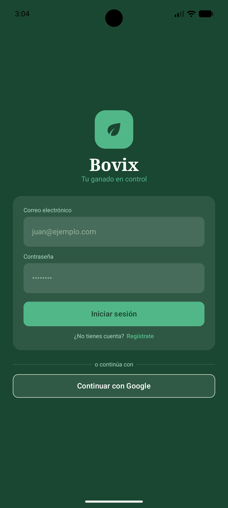

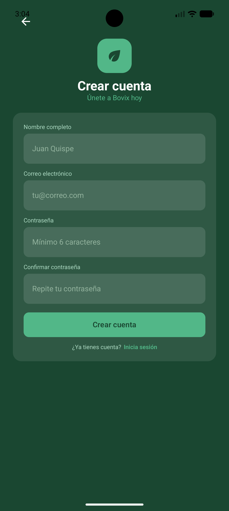

**Dashboard principal con estadísticas y actividad reciente (US015 – US016 – US017)**

Se desarrolló la pantalla principal (Home) con un panel de estadísticas reactivas que muestra en tiempo real: total de animales registrados, lotes activos, citas veterinarias programadas para el día y alertas pendientes. Adicionalmente, se implementó la sección de actividad reciente que presenta los últimos bovinos y planes de alimentación registrados por el usuario. Todos los contadores se actualizan automáticamente al crear o modificar registros, sin necesidad de recargar la pantalla.

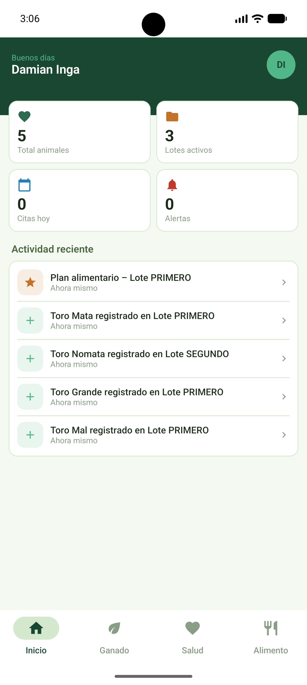

**Registro y gestión de ganado (US007 – US008 – US009)**

Se implementó el módulo completo de gestión de bovinos. El ganadero puede registrar nuevos animales completando campos como nombre, género, raza, peso, estado e imagen. La lista de animales se sincroniza con el backend mostrando únicamente los registros del usuario autenticado. Desde el listado es posible acceder al detalle de cada animal para editar su información, con validaciones que rechazan datos incorrectos e informan al usuario mediante mensajes de error.

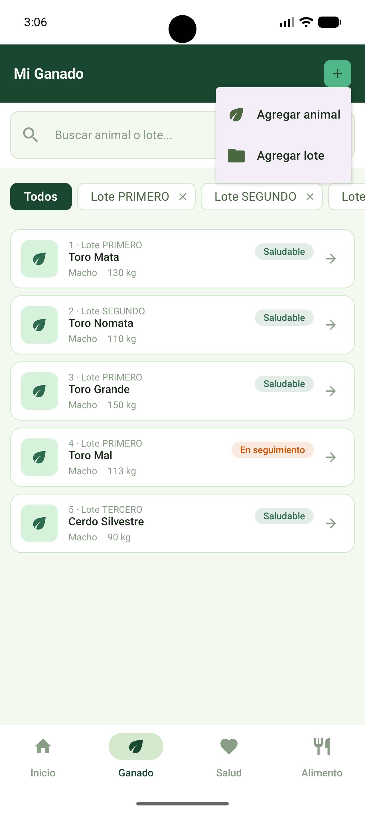

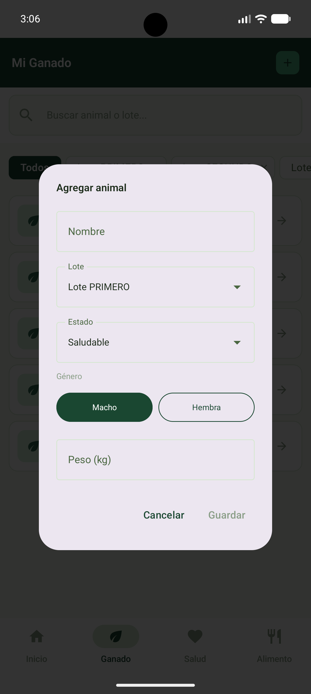

**Gestión de establos y lotes (US010)**

Se desarrolló la pantalla de establos que permite al ganadero organizar su ganado por corrales o lotes. El usuario puede crear nuevos establos, visualizar los existentes y eliminarlos. Cada establo queda asociado al usuario autenticado, garantizando el aislamiento de datos entre cuentas.

**Planes de alimentación (US011)**

Se implementó el módulo de alimentación, donde el ganadero puede registrar planes con sus componentes, porcentajes y raciones diarias en kilogramos. El sistema valida que los campos obligatorios estén completos antes de guardar, y muestra la lista de planes activos sincronizada con el backend.

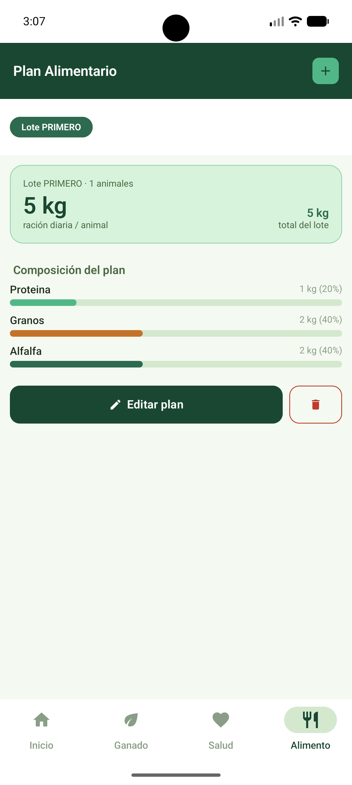

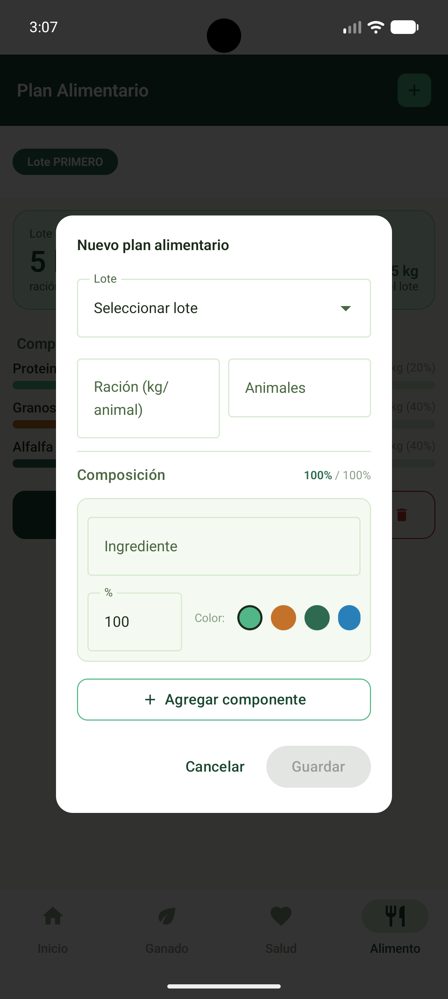

**Citas veterinarias y control sanitario (US012 – US013)**

Se desarrolló el módulo de salud animal con la pantalla de citas veterinarias. El ganadero puede registrar nuevas citas indicando el animal, tipo de atención, motivo, fecha programada y estado. El sistema muestra el listado de citas ordenadas por fecha, con la próxima cita destacada en el panel superior. Los registros se almacenan en la base de datos local (Room) y se sincronizan con el backend.

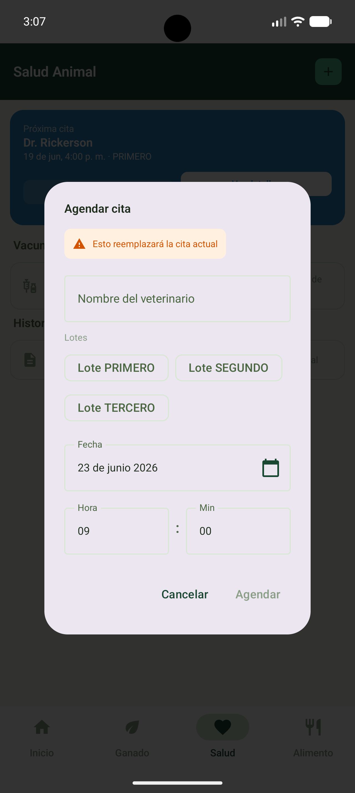

**Integración frontend-backend**

Se configuró el cliente HTTP Retrofit con un interceptor automático que adjunta el token JWT en cada solicitud al backend. Los datos remotos se sincronizan con la base de datos local Room, permitiendo que la aplicación funcione con datos en caché ante pérdidas temporales de conectividad. Todos los endpoints del backend filtran los datos según el userId extraído del token, garantizando el aislamiento de información entre usuarios.

**Vistas Flutter para el segmento veterinario (US018)**

Como parte del Sprint 2 se inició el desarrollo de la aplicación Flutter orientada al segmento de profesional de la salud veterinaria. En esta iteración se implementaron las vistas correspondientes al módulo de atención veterinaria especializada: pantallas de registro de visita técnica, diagnóstico clínico y control sanitario. Por el momento estas pantallas corresponden únicamente a la capa de presentación visual, sin integración con el backend, la cual está prevista para una iteración posterior.

---

### 4.2.2.6. Services Documentation Evidence for Sprint Review

Durante el Sprint 2 se documentaron de forma completa los servicios de backend
según la arquitectura definida en el Capítulo II.

**Plataforma de despliegue:** Render (Web Service con Docker) + Aiven (Base de datos MySQL 8.4.8)

**Documentación de Endpoints — Swagger:**

Se implementó la documentación interactiva de la API mediante Swagger UI, accesible desde el entorno de producción desplegado en Render. La documentación expone todos los endpoints REST del backend organizados por controlador: autenticación, bovinos, establos, planes de alimentación, citas veterinarias y resumen del dashboard.

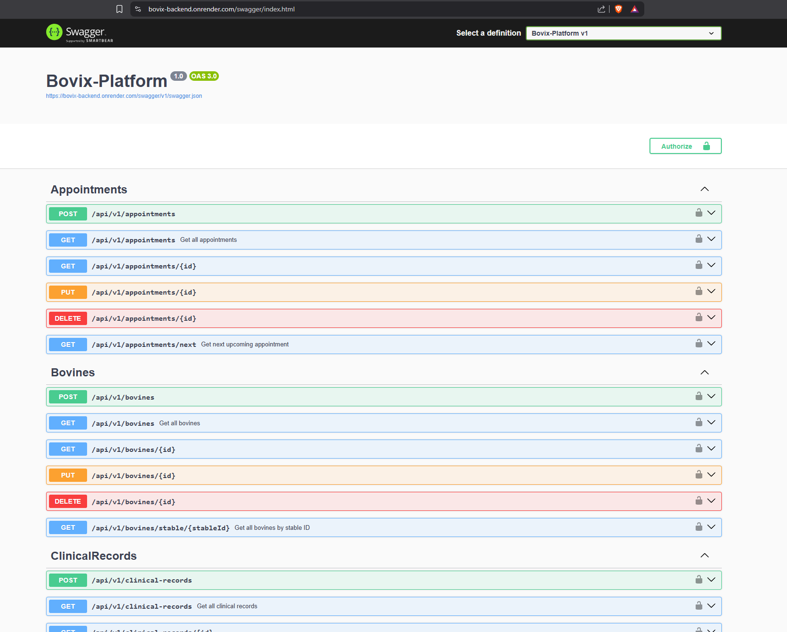

> **Enlace a documentación Swagger:** [BackEnd](https://bovix-backend.onrender.com/swagger/index.html)

---

### 4.2.2.7. Software Deployment Evidence for Sprint Review

Durante el Sprint 2 se realizaron dos despliegues públicos de la plataforma Bovix: el backend en Render y la aplicación móvil Android mediante Firebase App Distribution y Appetize.io.

**Backend — Render**

El backend desarrollado en .NET fue contenerizado con Docker y desplegado en Render como Web Service. La base de datos MySQL 8.4.8 se aloja en Aiven. El despliegue se realizó conectando el repositorio de GitHub con Render, que detecta automáticamente los cambios en la rama principal y redespliega el servicio.

**Pasos realizados para el despliegue:**

1. Se generó el `Dockerfile` en la raíz del proyecto backend.
2. Se configuró el Web Service en Render apuntando al repositorio `Bovix-Backend`.
3. Se añadieron las variables de entorno de conexión a la base de datos Aiven.
4. Render construyó la imagen Docker y publicó el servicio automáticamente.

> **URL del backend:** [https://bovix-backend.onrender.com](https://bovix-backend.onrender.com/swagger/index.html)

**Aplicación móvil Android — Firebase App Distribution**

La aplicación Android fue distribuida mediante Firebase App Distribution, permitiendo instalar la APK directamente en dispositivos Android sin necesidad de publicarla en Google Play Store.

**Pasos realizados para el despliegue:**

1. Se generó el APK desde Android Studio: Build → Build APK(s).
2. Se creó el proyecto en Firebase Console y se registró la app con el package `pe.edu.upc.bovix`.
3. Se subió el APK a Firebase App Distribution y se generó un enlace de distribución.

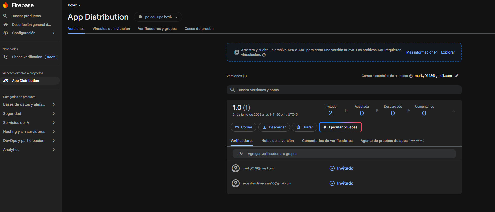

**Aplicación móvil Android — Appetize.io**

Como complemento para la presentación en vivo, la APK fue cargada en Appetize.io, una plataforma que permite ejecutar aplicaciones Android directamente desde el navegador sin necesidad de instalar ningún software adicional.

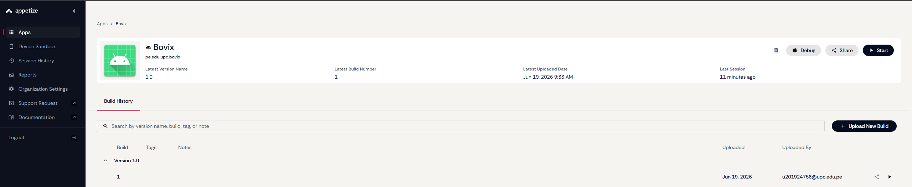

> **URL de la aplicación en Appetize.io:** [Bovix Android](https://appetize.io/app/b_opecsvwkpyvdg5ycxmr7a7g36m)

---

### 4.2.2.8. Team Collaboration Insights during Sprint

Durante el Sprint 2 el equipo mantuvo comunicación activa y colaboración organizada
mediante las siguientes herramientas:

**Project Management:**

- **Discord:** Canal principal de comunicación para reuniones de planificación,
  daily check-ins y resolución de dudas técnicas en tiempo real.
- **Google Meet:** Plataforma de videoconferencias utilizada para reuniones de
  revisión y retrospectiva del sprint.

**Source Code Management:**

Utilizamos GitHub para el control de versiones y el trabajo colaborativo.
Se siguió el modelo GitFlow con ramas `feature/` para cada funcionalidad y
se aplicó la convención de Conventional Commits en los mensajes
(`feat:`, `fix:`, `docs:`, `style:`, `refactor:`).

**Distribución del trabajo por integrante:**

| Integrante | Tareas principales en Sprint 2 |
|---|---|
| Flores Manrique, Sebastian Enrique | Implementación del backend: endpoints REST de bovinos y establos, middleware JWT y filtrado de datos por usuario autenticado |
| De las Casas Latour, Sebastián | Desarrollo de vistas Flutter del segmento de profesional de la salud veterinaria: pantallas de registro de visita técnica, diagnóstico y control sanitario (solo capa de presentación) |
| Esquirva León, Miguel Juan Diego | Implementación del backend: endpoints de planes de alimentación, citas veterinarias y endpoint HomeSummary |
| Inga Hernández, Ayrton Damian | Frontend Android: dashboard reactivo con estadísticas, sección de actividad reciente e integración Retrofit con interceptor JWT |
| Meza Tataje, David | Frontend Android: módulos de ganado (CRUD), establos y citas veterinarias |

## 4.3. Validation Interviews
### 4.3.1. Diseño de Entrevistas
### 4.3.2. Registro de Entrevistas
### 4.3.3. Evaluaciones según heurísticas
